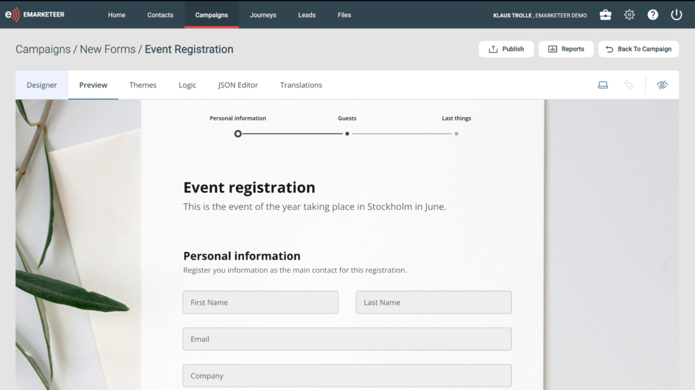

# Product launch — June 2025

The June 2025 release introduces a new form editor and a rebuilt, cookieless web tracker.

Together they change how you capture leads and how you attribute the traffic that produces them. This article summarizes what is new and what you need to do.

## The new form editor

Forms are where relationships with contacts begin. This new editor lets you create modern, flexible forms and surveys that convert.

Key features:

* Flexible designs to match your brand
* A user-friendly interface for form building
* New question types (20+ input types)
* Quizzes, scored surveys, timers, and calculators
* Improved respondent experience
* Mobile friendly (auto-complete, responsive)
* Website integration with automatic update
* Multi-language forms with translations
* GDPR-friendly reCAPTCHA
* Built-in UTM tracking for conversion performance

### What you need to know

* Your current forms are kept and renamed "Forms Legacy".
* You can still build forms using the old editor for now, but the new editor is the future.

### Getting started

Watch the [Forms editor video tutorial](https://www.youtube.com/watch?v=VKRJyNYDmbg) to get to know the new editor. When you are ready to put a new form on your website, follow the [embed instructions](../documentation/forms/publish-a-form.md).

## Cookieless web tracker

We have rebuilt our website tracking from the ground up.

The new tracking is completely cookieless, so you will track more traffic than before as more browsers block cookie-based tracking.

The new tracking picks up as soon as a visitor enters your site for the first time. Every time the visitor comes back, the tracking continues. When the visitor converts to a lead via your website form, all the tracking history is stored on the new lead. This tells you where the lead came from initially and helps you understand which traffic generation initiatives perform best.

Features:

* Cookieless tracking
* Detailed traffic source tracking
* Full contact web history logged on form submission
* Tracking initiated from email clicks and form submissions

### What you need to know

A new tracking script is required to unlock these features.

The existing tracking will continue to work temporarily but should be upgraded as soon as possible.

### Getting started

See [The web tracker](../documentation/the-web-tracker/) and the [installation instructions](../documentation/installing-the-web-tracker-script-on-your-website/).
