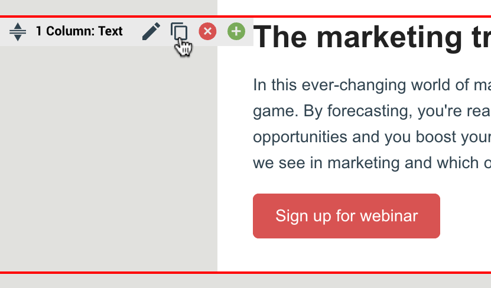

# Release notes: copy block in email editor and more campaign fields – eMarketeer Support

**New or updated features in eMarketeer**

-   Clone block in the email editor  
    You’re going to love this. You can now copy any type of content block you like when building an email. Just hover over the block you’d like to copy, click the duplicate icon and an exact copy of the block is pasted in your email.

-   More types of campaign fields  
    With campaign fields, you have your campaign updated in just a minute. We’re talking text, images, dates; just update it all in one place and it’s reflected in all campaign components. With this release, we have added more types of campaign fields and the complete list of types is as follows:  
    
    -   Text – for headlines or other short snippets
    -   Text area – for longer text, like summaries
    -   Rich text – use this if you want to customize your text with bold and italics, etc. In others, a bit more sophisticated text editor with more style options
    -   Date and time
    
    -   Images
    -   Droplist
    -   Date and time of latest update in campaign fields available in API  
          
        
-   Sort your campaign fields with drag and drop and field description  
    When you’ve got the hang of campaign fields, you won’t be able to stop using them. As you add more campaign fields, it might get difficult to get a good overview of the campaign fields you have in your campaign. Until this latest update that is. Now can now sort your list of campaign fields simply with drag-and-drop and add a short field description to get a quick overview and find the fields you’re looking for.  
      
    [Tutorial: how to use campaign fields](<how to use campaign fields>)

**General**

-   Small bug fixes
