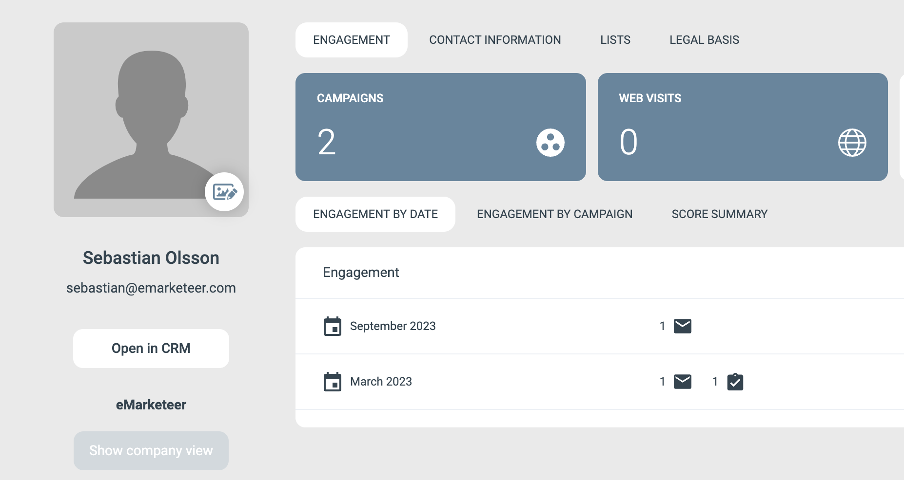
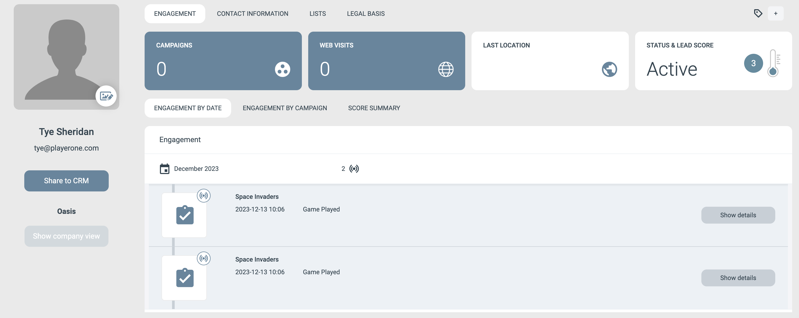
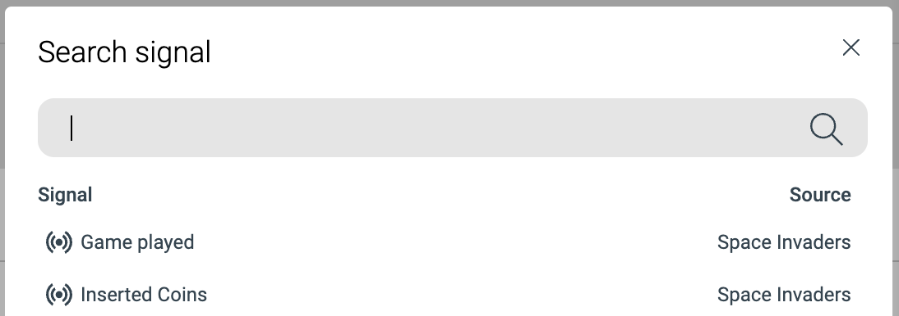

# Custom Signals API

API reference: [https://api-doc.emarketeer.com/?urls.primaryName=Engagement](https://api-doc.emarketeer.com/?urls.primaryName=Engagement)

***

Contacts in eMarketeer consist of three main parts:

* Contact fields
* Engagement
* Legal basis (consent)

Engagement records every interaction a contact makes with campaign components such as emails, forms, and landing pages. These interactions appear on the contact timeline and can be used to set lead score, trigger Journeys, and more. They give a 360-degree view of what the contact has interacted with over time.

<div data-with-frame="true"></div>

### Custom Signals

With the Custom Signals API you can send contact events from any other system into eMarketeer, as long as you have the contact's email address. These signals are added as timeline events on the contact and can be used in filters, scoring, Journeys, and lead generation.

In the following scenario, you have an arcade game called "Space Invaders". Each time someone plays the game, you want to record the event in eMarketeer. You could then trigger Journeys based on different criteria — for example, send an email to anyone who scores over 100.

<div data-with-frame="true"></div>

<div data-with-frame="true"></div>

### The custom signals structure

To send the example above as a signal through the API, you would use this payload. The parameters are explained below.

```
{
  "adapter": "Space Invaders",
  "category": "Game Played",
  "eventData": {
    "Player Name": "Parzival",
    "Reached Level": "8",
    "Score": "10"
  },
    "contact": {
        "firstName": "Tye",
        "lastName": "Sheridan",
        "email": "tye@playerone.com",
        "company": "Oasis"
  },
  "eventTime": "2023-12-13T10:06:42.375Z",
    "consent": {
    "marketing": {
      "allowed": true,
      "text": "I agree to emails"
    }
  }
}
```

A custom signal has the following main parts.

**Adapter**

The top-level name of the signal. It is listed directly under "Engagement" in the filter.

<div data-with-frame="true"></div>

Keep the number of distinct adapter names to a minimum, since all distinct adapter names appear directly under Engagement. A good practice is to use the service name of the signals you are sending. An adapter can then send multiple types of events.

In this example, the adapter name is "Space Invaders".

**Category**

The "verb" of the signal. In the Space Invaders example, possible categories include:

* Game played
* Inserted coins
* Got high score

<div data-with-frame="true"></div>

In the filter, once you select the adapter name "Space Invaders", you see the categories of signals you have sent for that adapter.

**Event data**

You can send any information you need with the signal. In this case, the "Game played" signal carries Player Name, Reached Level, and Score. All of these can be used in the contact filter to find contacts who played the game and reached a certain score or level.

<div data-with-frame="true"></div>

**Contact data**

All signals must be assigned to a contact. At minimum, you need an email address, but you can send any standard or custom field to the contact card to create or update the contact.

**Consent (optional)**

You can also send legal basis data for marketing emails along with the signal.

**Event Time**

The timestamp you want for the event in the timeline. Send it as Zulu time (UTC).
