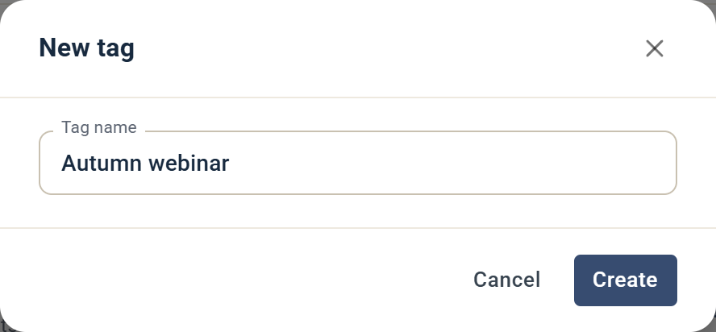

# Tags

Tags let you label campaigns and contacts so you can group, filter, and segment them. This article explains what tags are and how to use them in eMarketeer.

## What is a tag?

A tag is a piece of information that describes the data or content it is assigned to. Tags are non-hierarchical keywords used to classify and describe content. A tag does not carry any information or semantics on its own.

Tagging serves many purposes, including:

* Classification
* Marking ownership
* Describing content type
* Online identity

## How tags are used in eMarketeer

You can use tags on campaigns and contacts for many purposes.

### Campaigns

Setting tags on campaigns lets you define what each campaign is about. For example, you could tag your newsletter campaigns with "Newsletters" and "Sweden", and tag others with "Events" and a specific product area.

Once tagged, you can separate engagement in the filter by tag. For example, get all contacts who answered any form in events, or all contacts who opened any Swedish newsletter.

### Contacts

Tagging contacts lets you segment them more precisely. You can set tags manually on a contact, or use a bulk action to tag a list of contacts. You can also use Journeys to add or remove tags when contacts perform certain actions.

## The tag widget

You find the tag widget in a campaign (top right corner) or on the contact card (top right corner). Click the tag icon to open it.

The widget shows a search field and a list of your existing tags. Start typing to narrow the list.

### Create a new tag

If the tag you want does not exist, type its name in the tag widget and select **Create new "<name>" tag**.

You can also create tags in **Contacts** > **Tags**. In **Manage tags**, click **Create tag**, enter a tag name, and click **Create**.

### Rename or delete a tag

To rename or remove a tag completely from the system, go to **Contacts** > **Tags**. In **Manage tags**, click the edit icon to rename a tag, or the delete icon to delete it. Deleting a tag removes it from eMarketeer and from all contacts and campaigns that used it.

## Add tags to contacts or campaigns

Open the tag widget and select the tag you want to assign to the contact or campaign. The tag appears next to the tag icon.

## Remove tags from a contact or campaign

In the campaign or on the contact card, click the "x" on the tag to remove it.

