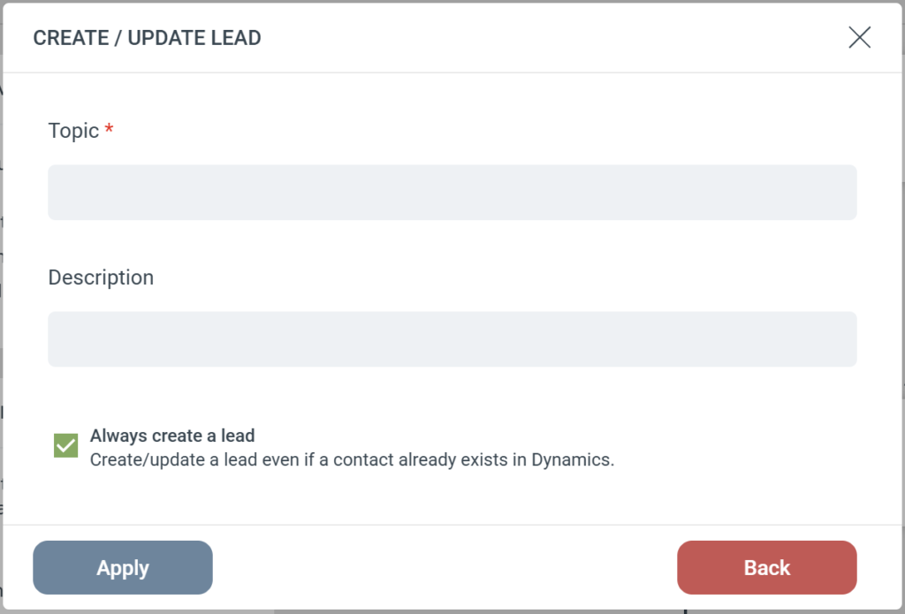

# Dynamics - Create/Update Lead

The **Create/Update Lead** Step pushes contacts from eMarketeer into your Microsoft Dynamics CRM as Leads. It includes built-in logic to update existing records and prevent duplicates.  
Step Configuration  
When adding this Step to your Journey, you will configure the following fields:

-   **Subject (Required):** Sets the main title for the Lead record in Dynamics (e.g., “Webinar Attendee” or “Contact Us Form”).
-   **Description:** Passes along additional notes, campaign details, or context to your sales team.

### The “Always create a lead” Setting

This checkbox dictates exactly how eMarketeer searches your CRM and handles existing records.  
**If Unchecked (Default)** This option protects your CRM from creating Leads for people who have already progressed in your sales cycle.

-   eMarketeer first checks Dynamics to see if the person already exists as a Contact.
-   **If they are a Contact:** The Step stops completely. No Lead is created.
-   **If they are not a Contact:** eMarketeer will update an existing Lead. If no Lead is found, it will create a brand new one.

**If Checked** This option forces the Step to process the Lead, regardless of whether the person is already a Contact in your CRM.

-   eMarketeer bypasses the initial Contact check and attempts to update an existing Lead.
-   If no existing Lead is found, it creates a new Lead.
-   **Smart Linking:** If it creates a new Lead _and_ the person already exists as a Contact in Dynamics, eMarketeer will automatically link the newly created Lead to their existing Contact and Account records.
