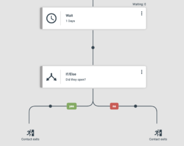
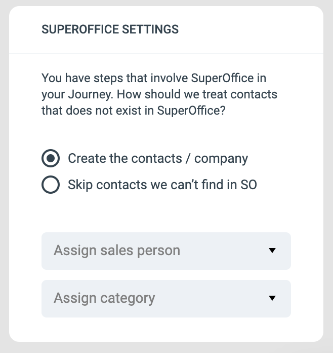

# Creating your first Journey

### Accessing the Journey Builder

Click on “Journeys” in the top navigation bar. Then click “Create new Journey” to create your first Journey.

### Adding a Starting Point or Trigger

When you create a new Journey, the first task is to create the starting point of the Journey.

A starting point is a set of filter rules. Any contact that matches the filter will start the Journey.

**Note:** The starting point will only trigger on contacts that matches the filter from the time of activation.  
It will not include all contacts that matches the filter historically.

Once your starting point is set, click “Apply” to enter the Journey editor.

Don’t worry, the Journey will not start until you activate it.

For now this is all you need to know about Journey Starting points, though be sure to check out [this detailed overview on Journey triggering events](https://support.emarketeer.com/documentation/journeys/journeys-triggering-events/) to learn exactly when Journey Starting points are evaluated.

### Build your Journey

Once you have set the starting point you enter the Journey Builder. This is where you add the steps (actions) you want to execute for each contact entering the Journey.

Click the black dots to add the steps you want to add in sequence.

### Setting Up Wait Conditions

The Journey builder also allows you to split the journey into branches depending on criteria you decide.

Ex. Your Journey can send an email and then wait for a day and perform different actions depending on if the email was opened or not.

You first add the wait step, and then the If/Else step to split the path into branches.

> It is very important that you add a wait step prior to an If/Else step or it will be evaluated immediately.

The If/Else step is also a filter where you can set any criteria to be met. Once you added the If/Else step the branch will have two branches. One for those contacts who meet the criteria, and one for those who don’t. It is very important that you add a wait step prior to an If/Else step or it will be evaluated immediately, especially if you are evaulating interactions from a previous step.

Now you can continue building your Journey for the two separate branches.

### Sending emails and SMS

The Journey steps include sending emails and text messages (SMS). In order to access them from the Journey, you first need to create them in a campaign.

All reports for the sent components are also located in the campaign where you built them. You can go directly to the report for an email or SMS by opening the settings menu for the step.

### Save your Journey

Any changes made to a Journey must be saved before they take effect. Press the “Save” button in the top right corner to save your Journey.

### Activating a Journey

When your first Journey is created (by clicking “Save”) it will be paused. This means the Journey is inactive and no contacts will enter during the time it is paused.

When you are ready to activate your Journey, click the toggle button in the top right corner to activate it.

### 

When the Journey is active, any new contacts matching the starting point filter will enter the Journey.

### Editing a Journey

You can at any time make changes and edit your Journey. However, the Journey needs to be paused before any editing can be made.

When your editing is done, remember to save the changes and activate the Journey again.

## Journey settings

### Re-enter Journey

By default a contact can only enter a Journey once. If a contact matches a starting point again, after it already entered once, it will be skipped.

If you want a contact to be able to enter a Journey multiple times, you can check the option “Contact can re-enter Journey”.  
When checked and saved,

## Monitoring and Analytics

### Tracking Journey Performance

Contacts in a Journey can have three different statuses.

-   Contacts started – this is the number of contacts that matched the starting point filter and have entered the Journey.
-   Contacts in progress – Any contact that started the Journey but has not completed it yet are “in progress”. If you don’t have any wait steps in your Journey, contacts are very briefly in the Progress status. However if you have wait steps many contacts can be waiting and still be in progress.
-   Completed Journeys – number of contacts who completed all steps in the Journey

### Step counter

Each step in the Journey has a step counter that shows how many contacts has reached that step.

You can click on the number to bring up a list of the contacts for that step. From there you can also export or bulk update the contacts.

The wait step has an additional counter, and that is how many contacts are currently waiting in that step.

## Journeys and SuperOffice

The steps collection contains several actions that can perform tasks in SuperOffice. All tasks relate to contacts in SuperOffice.

### Contact matching

When a task is performed in SuperOffice we first check if the contact exists in SuperOffice. This is done by matching the external-id and email address of the contact.

If a matching contact is not found, by default the Journey step will not be performed.

### Creating missing contacts in SuperOffice

When you add a Journey step involving SuperOffice, you will see a setting panel on the left sidebar.

It defaults to skip contacts that we can’t find in SuperOffice, but you can also set it to automatically create the missing contacts in SuperOffice by selecting it to do so.

If you want to create the contacts in SuperOffice you also need to provide a responsible sales person and a category for the newly created contacts/companies.

When creating contacts and companies automatically we use a logic that tries to find any existing company that would be suitable for the new contact, or even create the contacts without company if allowed.

The setting about contact creation will be used for all SuperOffice steps in the Journey.

If you want a flow chart describing the logic, [click here](https://support.emarketeer.com/wp-content/uploads/2023/05/Skarmavbild-2023-05-25-kl.-12.31.12.png).

**Tip!** When you enable to create new contacts it’s good practice to also add them to a selection in SuperOffice. That way you can easily find the new contacts.
