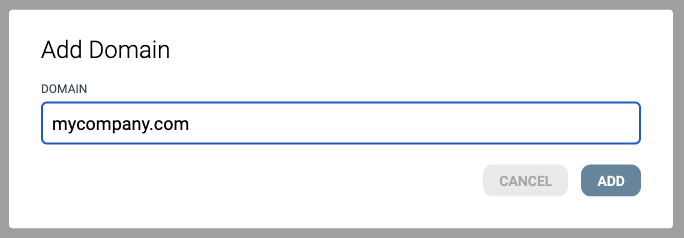
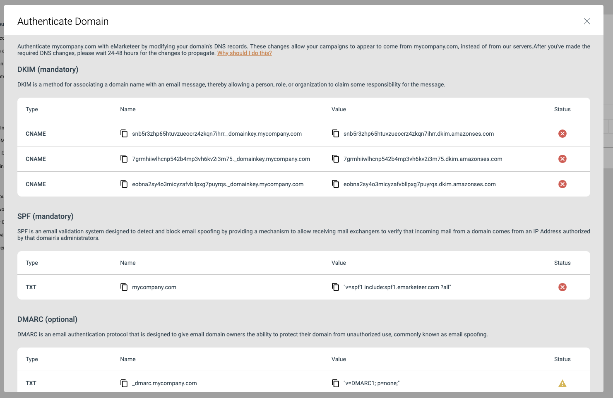
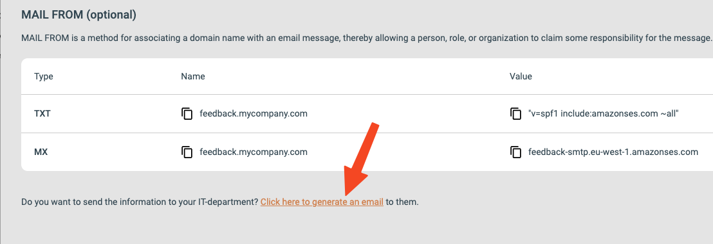

# Using your own email domain with eMarketeer

This article walks through authenticating your own email domain in eMarketeer in three steps.

Sending email from your own domain is required to send any email through eMarketeer. It also gives you the best deliverability, trust, and response from your recipients. To authenticate, you add DNS records that prove the email is authorized by your company and not fraudulent. eMarketeer supports SPF, DKIM, and DMARC validation.

When a domain is authenticated, you can use it as the From address in your emails. The domain is also used as the return-path, which aligns with DMARC.

If this sounds too technical, follow the steps below. eMarketeer can also generate a pre-written email you can forward to your IT department.

### 1. Go to email domains settings

Go to your [email domain settings](https://app.emarketeer.com/corporate/gui/account/customize/domain/new.php). You must be logged in to eMarketeer as an administrator for the link to work. You can also reach the settings by going to "Account settings" > "Email domains" in eMarketeer.

### 2. Add a domain

Click "Add a domain" and type the domain you want to use, for example `yourcompany.com`. Click "Add". You do not need to add `www` before the domain name.

### 3. Update your DNS records

eMarketeer shows a list of records that need to be added to your DNS. When the records are added, click "Authenticate".

### Ask your IT department

If you do not have access to your DNS, click the "Generate email" link at the bottom of the dialog. A pre-written email with the records opens, ready to send to whoever manages domains at your company — usually someone in IT.

When the records have been added correctly, they are marked green after you click "Authenticate". DNS changes often propagate quickly, but can take up to 48 hours. After authentication, you can send emails from your domain.

### Mandatory and optional fields

The mandatory fields are DKIM and SPF. Without these, emails fail checks by spam filters.

The optional fields are DMARC and Email From. These protect your emails further and make sure DMARC passes. Email From uses your own domain as the return path of the email (but the address is still received by eMarketeer).
