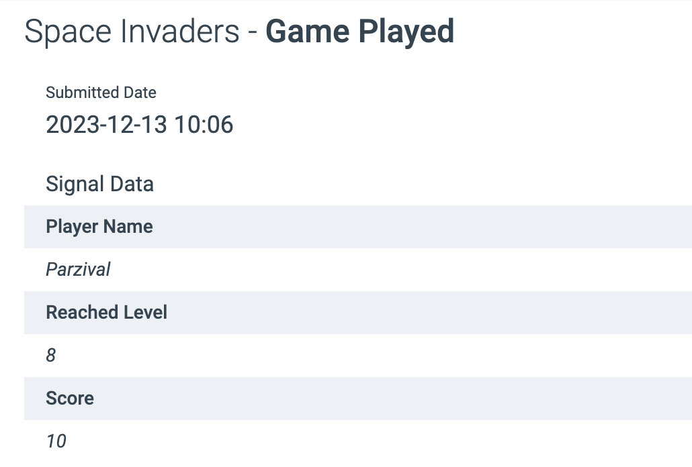

# Custom Signals API

This tutorial explains how to use the Signals API to send in contact events using this API  
[https://api-doc.emarketeer.com/?urls.primaryName=Engagement](https://api-doc.emarketeer.com/?urls.primaryName=Engagement)

* * *

Contacts in eMarketeer mainly consists of these three parts:

-   Contact fields
-   Engagement
-   Legal basis (consent)

Engagement is by default registering every interaction the contact makes with campaign components such as emails, forms, landing pages etc. which can be seen on the contact timeline. These interactions can be used to set lead score, trigger Journeys and more. It also gives a 360 view of what this contact has been interacting with over time.


### Custom Signals

With the Custom Signals API you can send in contact events from any other system to eMarketeer, as long as you have the email address of the contact. These signals will be added as timeline events on the contact to be used in filters, scoring, Journeys and lead generation.

In the following scenario you have an arcade game “Space Invaders”, and each time someone plays the game you want to store the event in eMarketeer. You could then trigger Journeys based on different critera. Ex. send an email for anyone who get a score over 100.




### The custom signals structure

To send the above example as a Signal theough the API, you would use this payload. Please continue reading about how to use the different parameters.

```
{
  "adapter": "Space Invaders",
  "category": "Game Played",
  "eventData": {
    "Player Name": "Parzival",
    "Reached Level": "8",
    "Score": "10"
  },
    "contact": {
        "firstName": "Tye",
        "lastName": "Sheridan",
        "email": "tye@playerone.com",
        "company": "Oasis"
  },
  "eventTime": "2023-12-13T10:06:42.375Z",
    "consent": {
    "marketing": {
      "allowed": true,
      "text": "I agree to emails"
    }
  }
}
```

A custom signal has the following main parts

**Adapter**

This is the top level name of the signal and will be listed directly under “engagement” in the filter.


Make sure you keep the different adapter names to a minimum since all distinct adapter names will be listed directly under engagement. A good practice is to use the service name of the signals you are sending. An adapter can then send multiple types of events.

Our custom signal will have the name “Space Invaders”

**Category**

This is the “verb” name. In the Space Invaders example we can have different categories. Such as

-   Game played
-   Inserted coins
-   Got high score


In the filter, once selecting the adapter name “Space Invaders” you will see the different categories of signals you have sent for this adapter.

**Event data**

With the signal you can send event data with any information you need. In this case the “Game played” signal tells Player Name, Reached Level and Score. These can all be used in the contact filter to find all who played a game and reached a certain score or level.


**Contact data**

All signals needs to be assigned to a contact. You need at least an email address but can send any standard or custom field to the contact card to create or update the contact.

**Consent (optional)**

Along with the signal you can also send legal basis data for marketing emails.

**Event Time**

This is the timestamp you want for the event in the timeline. You send it as “Zulu time” (UTC).
