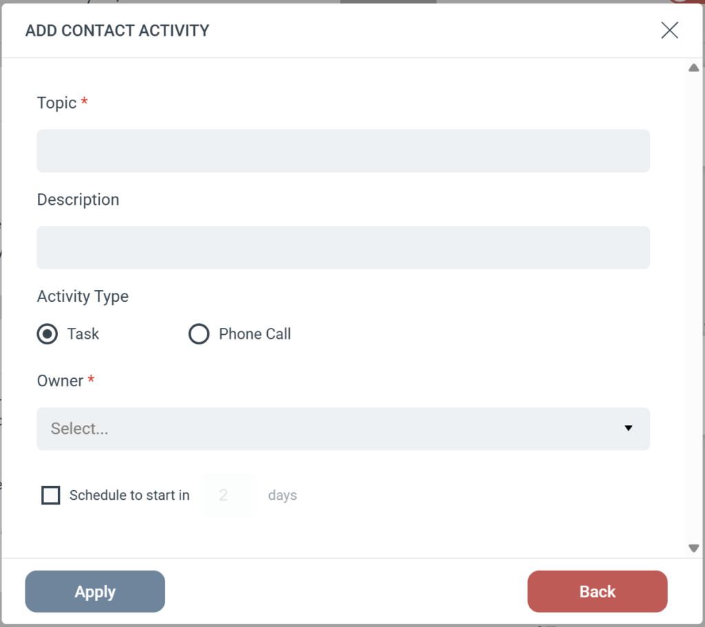

# Dynamics - Add contact activity

The Add Contact Activity step creates a Task or Phone Call strictly on a **Contact** record in your Microsoft Dynamics CRM. Unlike the generic Add Activity step, this action does not fall back to a Lead if no Contact is found.

### Step configuration

When you add this step to a Journey, configure the following fields:

- **Subject (required):** Sets the title of the activity in Dynamics.
- **Description:** Provides additional details or notes for the person completing the task.
- **Activity Type:** Choose whether to log the activity as a **Task** or a **Phone Call**.
- **Owner (required):** Select the Dynamics user who will be assigned the activity.
- **Schedule:** Optionally set a delay for the activity (for example, "Schedule to start in 2 days").

### Strict Contact matching

Because this step is designed specifically for Contacts, eMarketeer uses a strict search process:

- eMarketeer searches Dynamics exclusively for a matching Contact.
- If a Contact is found, the activity is created and attached to that Contact record.
- **If no Contact is found:** The step is skipped and no activity is created. eMarketeer does **not** attempt to find or update a Lead record.
