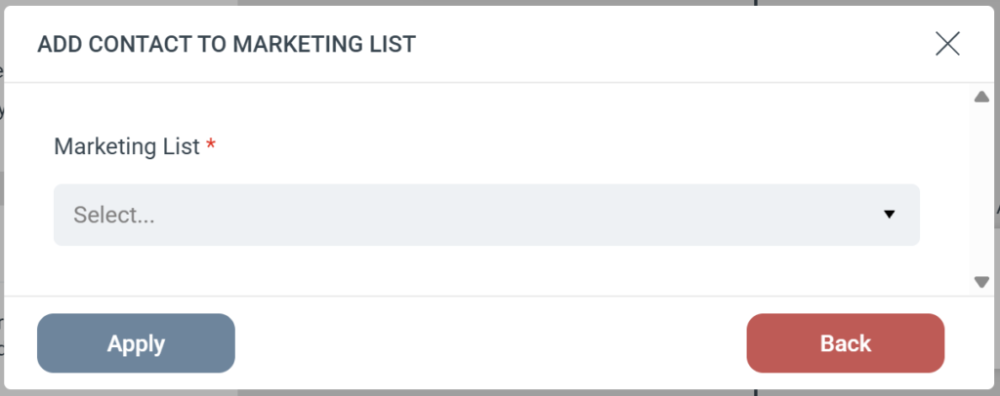

# Dynamics - Add Contact to Marketing List

The Add Contact to Marketing List step automatically adds a person to a designated Marketing List in your Microsoft Dynamics CRM. This action targets **Contact** records specifically.

### Step configuration

When you add this step to a Journey, you only need to configure one field:

* **Marketing List (required):** Select the Dynamics Marketing List from the dropdown menu where you want to add the Contact.

### Strict Contact matching

Because this step is designed specifically for Contacts, eMarketeer uses a strict search process:

* eMarketeer searches Dynamics exclusively for a matching Contact.
* If a Contact is found, they are added to the selected Marketing List.
* **If no Contact is found:** The step is skipped and the person is not added to the list. eMarketeer does **not** attempt to find or add a Lead record.
