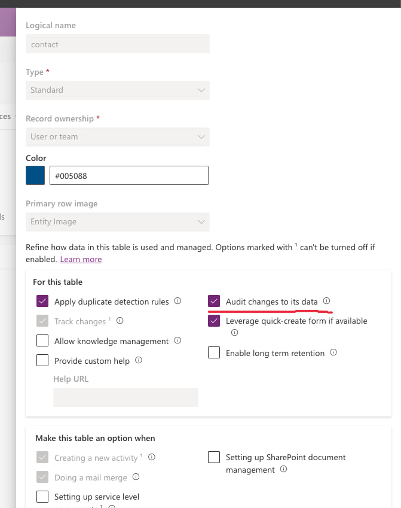
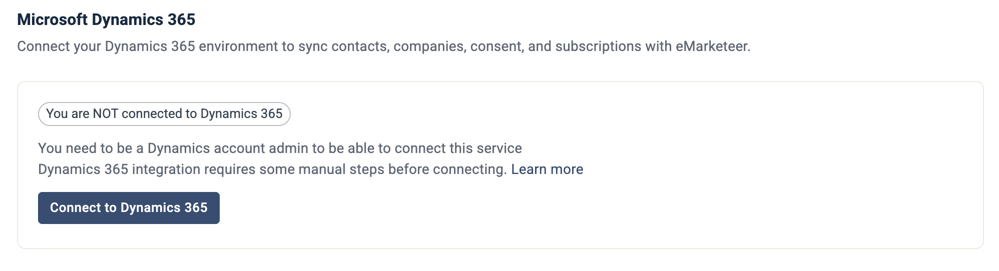
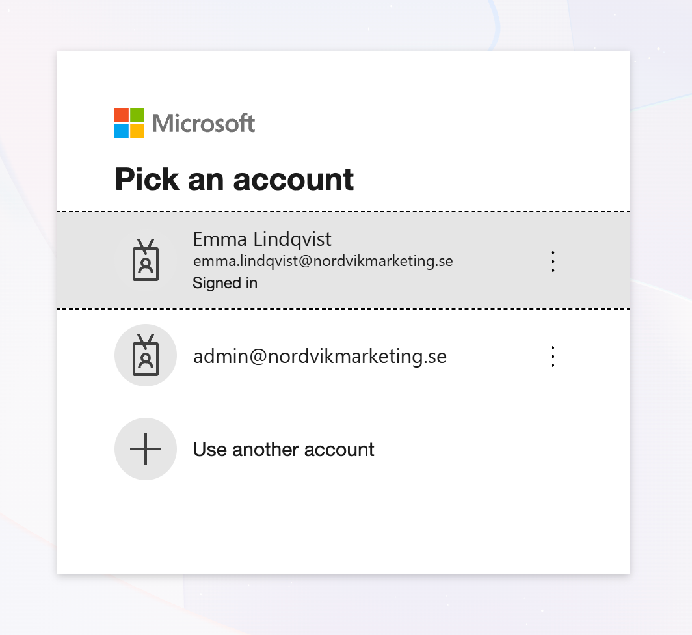
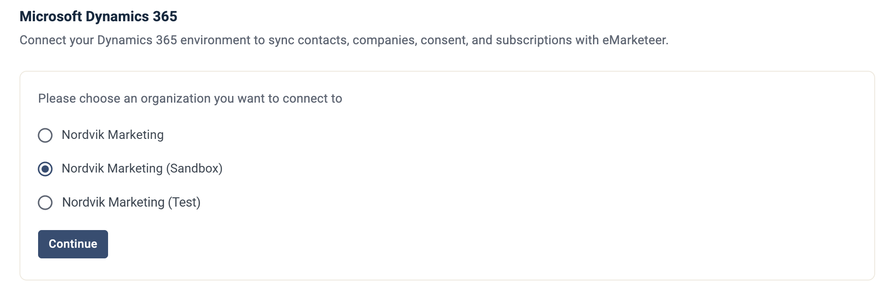

# Dynamics - Installation Process



### Create an app user in the Power Platform environment

As a **System Administrator**, follow these steps:

1. Navigate to a consent URL and add the app: `https://login.microsoftonline.com/<your tenant id>/adminconsent?client_id=a2a5e177-5102-4792-b0eb-52f4539f3cf7`
2. Open the **Power Platform Admin Center** at `https://admin.powerplatform.microsoft.com`.
3. Go to **Manage > Environments** and select the environment you are configuring.
4. Open **Settings → Users + permissions → Application users**.
5. Click **+ New app user**.
6. In the app selection screen, choose **eMarketeer Marketing Cloud**. If it is not visible, search using the App ID `a2a5e177-5102-4792-b0eb-52f4539f3cf7`.
7. Assign the security role **System Administrator** to the app user.
8. Click **Save**.


### Enable auditing for consent sync

To ensure consent data syncs correctly, enable auditing for the Contact table.

1. Go to Power Apps at `https://make.powerapps.com`.
2. Navigate to **Tables → Contact**.
3. Click **Properties**, then **Advanced options**.
4. Check **Audit changes to its data**.
5. Click **Save**.



### Enable the integration in eMarketeer

This action requires the Administrator role.

In eMarketeer, click the gear icon at the top right, choose **Account Settings**, open **Integrations**, and click **Manage** on the **Microsoft Dynamics 365** card.

Click **Connect to Dynamics 365**.

Microsoft asks you to pick an account. Choose a Microsoft account that has access to the Dynamics environment you want to integrate, or click **Use another account** to sign in with a different one.

Choose the organization (environment) you want to integrate with and click **Continue**.



