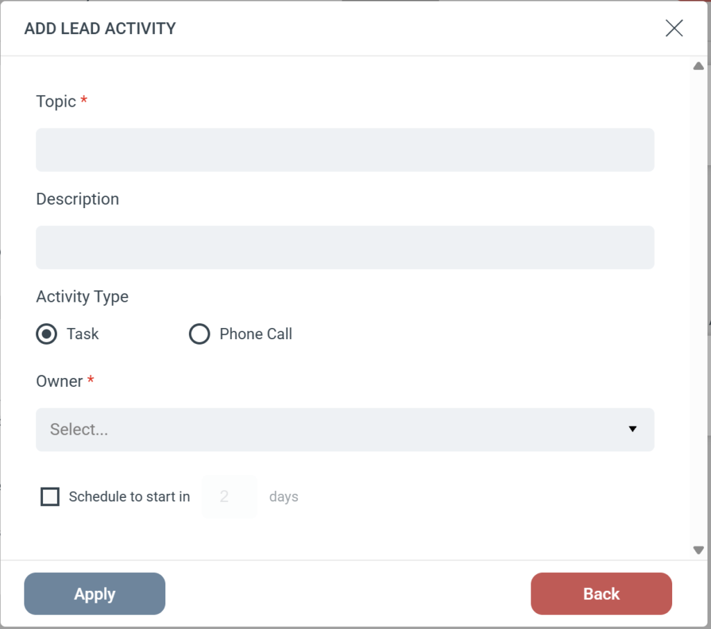

# Dynamics - Add Lead activity

The **Add Lead Activity** Step creates a Task or Phone Call strictly on a **Lead** record in your Microsoft Dynamics CRM. Unlike the generic “Add Activity” Step, this action will not fall back to a Contact if a Lead is missing.  
Step Configuration  
When adding this Step to your Journey, you will configure the following fields:

-   **Subject (Required):** Sets the title of the activity in Dynamics (e.g., “Follow-up Call” or “Send Pricing Guide”).
-   **Description:** Provides additional details or notes for the person completing the task.
-   **Activity Type:** Choose whether to log the activity as a **Task** or a **Phone Call**.
-   **Owner (Required):** Select the Dynamics user who will be assigned the activity.
-   **Schedule:** Optionally set a delay for the activity (e.g., “Schedule to start in 2 days”).

### Strict Lead Matching

Because this Step is specifically designed for Leads, eMarketeer uses a strict search process:

-   eMarketeer searches Dynamics exclusively for a matching Lead.
-   If a Lead is found, the activity is created and attached to that Lead record.
-   **If no Lead is found:** The Step is skipped, and no activity is created. eMarketeer will **not** attempt to find or update a Contact record.
