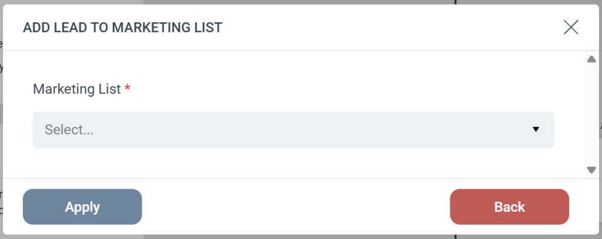

# Dynamics - Add Lead to Marketing List

The **Add Lead to Marketing List** Step automatically adds a person to a designated Marketing List in your Microsoft Dynamics CRM. This action specifically targets **Lead** records.  
Step Configuration  
When adding this Step to your Journey, you only need to configure one field:

-   **Marketing List (Required):** Select the specific Dynamics Marketing List from the dropdown menu where you want to add the Lead.

### Strict Lead Matching

Because this Step is specifically designed for Leads, eMarketeer uses a strict search process:

-   eMarketeer searches Dynamics exclusively for a matching Lead.
-   If a Lead is found, they are added to the selected Marketing List.
-   **If no Lead is found:** The Step is skipped, and the person is not added to the list. eMarketeer will **not** attempt to find or add a Contact record.
