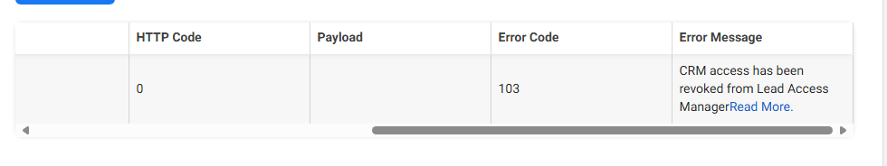

# Facebook Lead Forms

**When advertizing on Facebook you have the option to add a Call to Action to your ads. This is a great way to collect registrations, leads, sign ups and more directly from Facebook to eMarketeer.**

Requirements:

-   A Facebook business entity with access to one or more pages
-   A Facebook personal profile with access to the above business

[Read more about creating Lead Forms on Facebook here](https://www.facebook.com/business/help/397336587121938?id=735435806665862).

With the eMarketeer Facebook connector you can automatically send all Lead Form submissions directly to eMarketeer to

-   Create and update contacts
-   Set Lead Score
-   Trigger Journeys
-   Send leads to Sales

### Get started with Facebook Lead Forms

First make sure you have one or more Business on Facebook.

As an admin in eMarketeer, click “Settings”, “Plugins and integrations” and “Facebook”.  
Click “Connect to Facebook” to initiate the connection.

In the Facebook popup, log in with your personal profile to identify yourself.

In the next step you will choose from which businesses you want to receive leads from. You can choose among all business you have access to.

Click “Contitnue”. From the selected Businesses you will select which pages you want to connect. As before you can choose all or specific pages.

Lastly you will agree to the permissions for eMarketeer and save the connection.

**You are now connected!**

eMarketeer now lists the Businesses we have access to. Your last step is to check which businesses you want to receive leads from. These can be enabled or disabled at any time on this page.

### Receiving leads

For leads to be sent to eMarketeer you need to create ads on your Meta Business account. [Read more on Facebook](https://www.facebook.com/business/help/375478503258484?id=735435806665862).

👉 Once you have created lead ads, [you can use this tool](https://developers.facebook.com/tools/lead-ads-testing/) to test-submit your forms without publishing your ads.

When you get any answer, real or test, on your lead form on Facebook it will automatically be sent to eMarketeer. In eMarketeer you can find them under Contacts in the Engagement filter.

### Process incoming leads from Facebook

Once you have leads coming in and you see your test in the Engagement filter, you can start processing the incoming leads. You can:

-   Set lead score
-   Start Journeys
-   Create leads on the Lead Board

### Troubleshooting

**Meta Lead Ads Testing tool gives error and no leads are coming into eMarketeer**

When creating a [test lead](https://developers.facebook.com/tools/lead-ads-testing/) the status column should show “Success”. If it instead shows “Failed” and you get the the error message about “CRM access” below, you need to give eMarketeer access to your leads.

****

1.  To solve this, log in to [https://business.facebook.com](https://business.facebook.com) and choose the business account you want leads from.
2.  In the left menu choose Settings (the cog wheel) and then “Integrations” and “Lead Access”.
3.  Your Pages appear and you choose the page you want to get leads from.
4.  You will see three tabs. “People”, “Partners” and “CRM”. Choose the “CRM” tab.
5.  If you do not see “eMarketeer” in the list, click “Assign CRM” and choose to add “eMarketeer” in the list of available CRMs.

Done, you have nog given eMarketeer access to your leads. Try the Meta Lead Ads Testing tool again and it should work.
