# Styling your form

Style your form to match your brand using the **Themes** tab in the form editor. You change colors, fonts, sizing, corner radius, shadows, and more — without writing any code.

This guide walks through the theming options, from applying a ready-made theme to fine-tuning the header and background. For a tour of the whole editor, see [Form editor: UI overview](ui-overview.md).


You cannot add custom CSS through the Themes tab, so you are limited to the options it offers. A form embedded on your website, however, can have styling injected when it's called. To read more, see [Embed forms on your website](publish-a-form.md#style-the-form).


## About form themes

A theme is a collection of visual settings that apply across your whole form — colors, fonts, spacing, and shape. The Themes tab gives you a no-code interface to adjust those settings, start from a preset, and save the result.

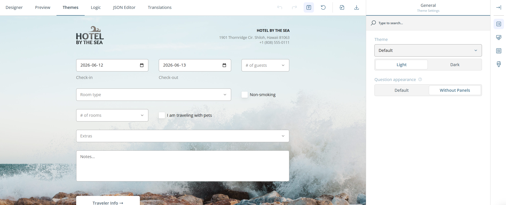


You can export a custom theme as a JSON file and import it on another form to reuse the same style, keeping a consistent look across every form you build.

You can also turn a finished form into a template from the Campaign Components view. Templates act as starting points when you create new forms. Making templates is available to users with the Developer role.


## Choose and apply a theme

The fastest way to restyle a form is to pick a different theme.

Open the **Theme** dropdown under the **General** category and select one of the presets. Each preset comes in several variations, including compact and dark versions, so you have a wide range of starting points.

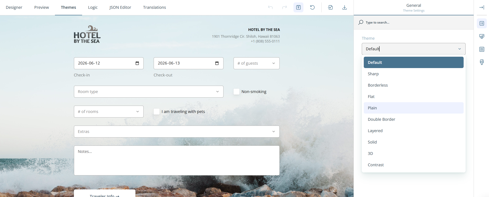

Applying a theme is a starting point, not a commitment — you can adjust any individual setting afterwards.

## Enable dark mode

Dark mode suits low-light viewing and pairs well with darker brand palettes.

Set the **Light / Dark** toggle to **Dark** to switch the form to a dark color scheme.

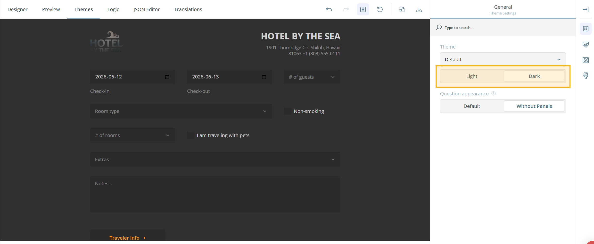

## Show questions without boxes

By default, each question sits in its own box. You can remove these boxes for a lighter, more open look.

Under the **General** category, set **Question appearance** to **Without Panels**. The boxes around individual questions disappear.

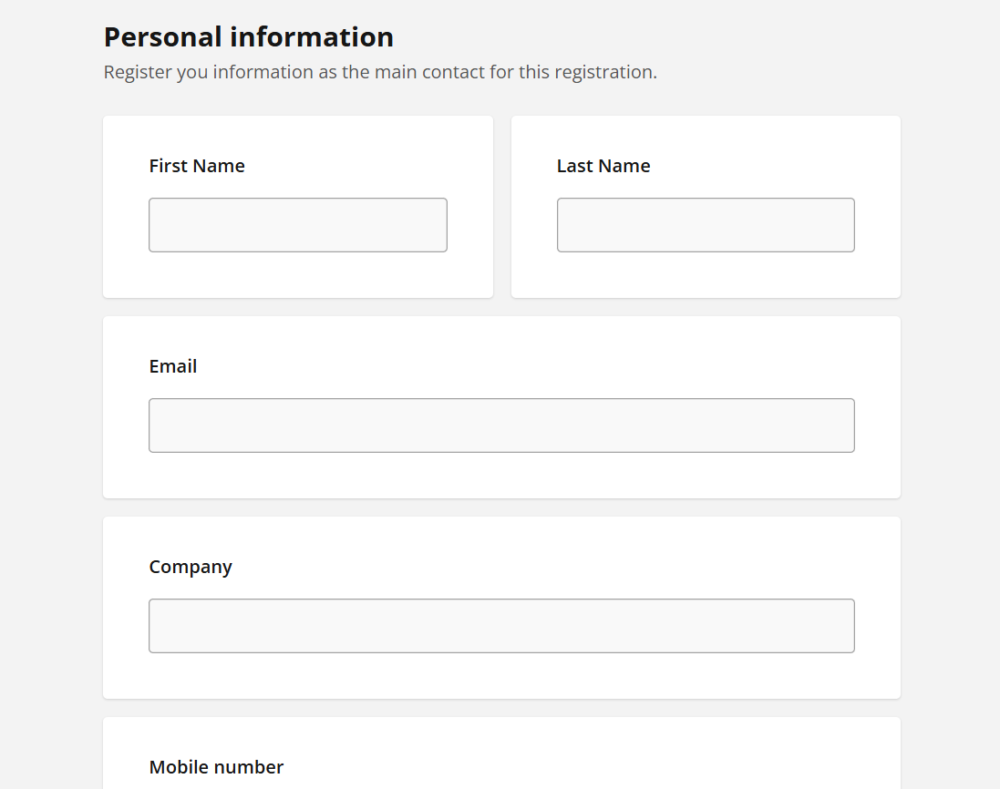

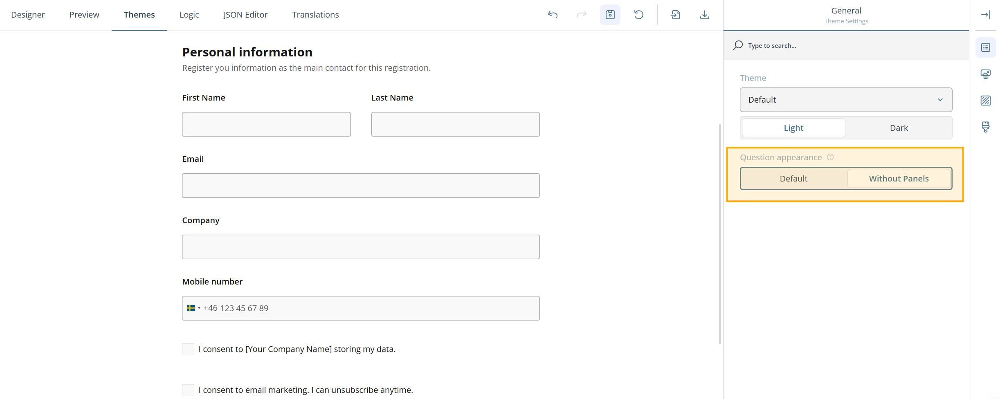

Panels (groups of questions) keep their own borders, so grouped questions stay visually contained even when individual boxes are off.

## Style the form header

The header is the area at the top of the form that holds your logo, title, and description. You can style each part.

### Add a logo

To add your logo to the header:

1. Switch to the **Designer** tab.
2. Open **Logo** in the **Survey Header** category.
3. Paste an image link in the **Survey logo** field, or click the folder icon to upload a file.
4. Optionally set **Logo width** and **Logo height** (in CSS units) to resize it.
5. Choose a **Logo fit** option: None, [Contain](#contain), [Cover](#cover), or [Fill](#fill).

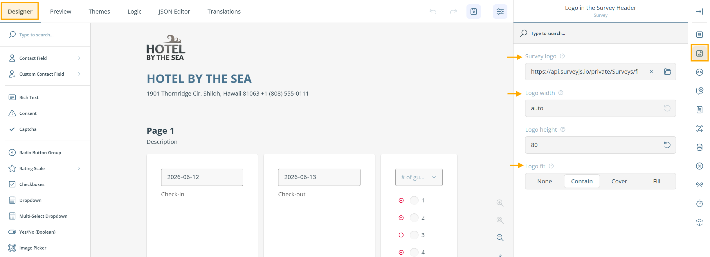

To position the logo, switch to the **Themes** tab, open the **Header** category, and set the **Logo alignment** property.

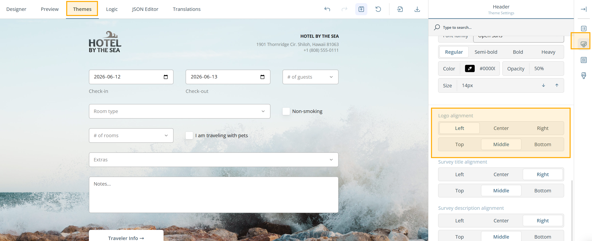

### Title and description

The title and description sit alongside the logo in the header. The following settings live under the **Header** category in the **Themes** tab.

#### Adjust text width

Use the **Text width** property to set how much of the header area the title and description occupy.

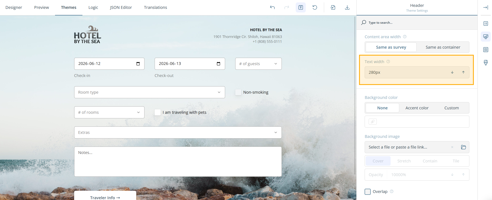

#### Customize fonts

Find the **Survey title font** and **Survey description font** sections. For each, you can set:

* **Font family** — choose from the dropdown.
* **Font weight** — Regular, Semi-bold, Bold, or Heavy.
* **Color** — pick a color or enter an RGB, HEX, or HSL value.
* **Opacity** — set the percentage next to the color.
* **Font size** — set the size in pixels.

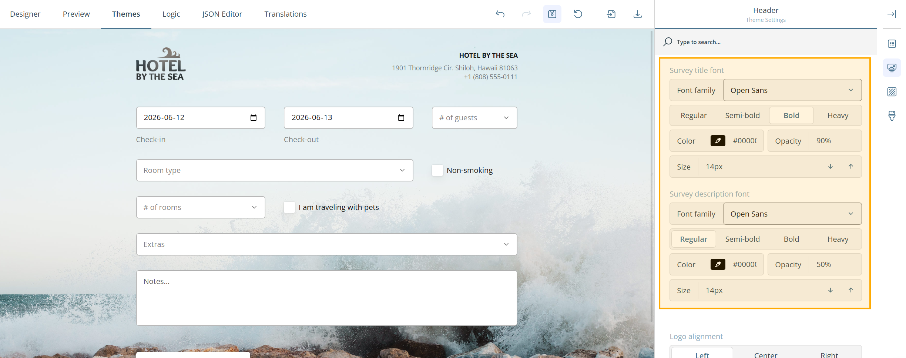

#### Align text

Use the **Survey title alignment** and **Survey description alignment** properties to set the horizontal and vertical position of each.

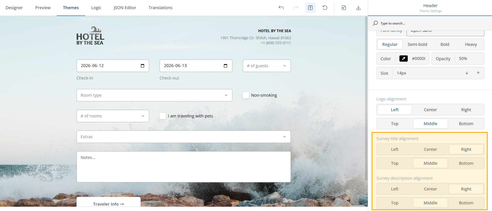

### Customize the header area

Switch the **View** toggle to **Advanced** to reveal the full set of header-area settings.

* **Height** — set the header height on desktop.
* **Height on smartphones** — set the header height on mobile.
* **Background color** — choose None, [Accent](#accent), or Custom (with a color picker).
* **Background image** — paste a link or upload a file, then set the display style (Cover, [Stretch](#stretch), Contain, or [Tile](#tile)), the opacity, and whether the header content overlaps the image.

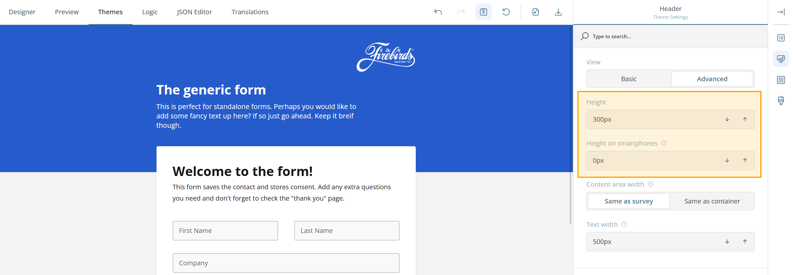

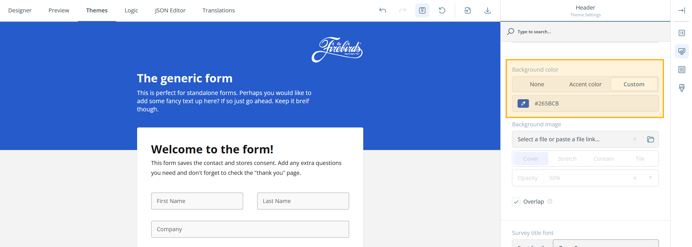

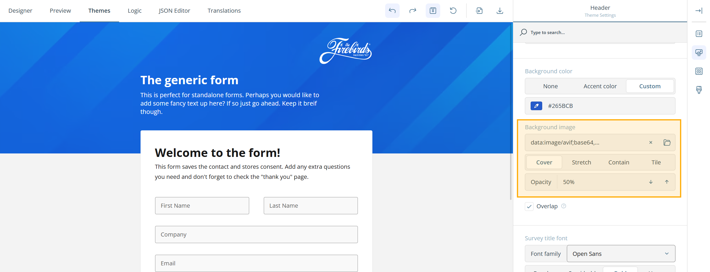

### Adjust the header content area

With the **View** toggle set to **Advanced**, use the **Content area width** property to choose whether the header content matches the survey width or the container width.

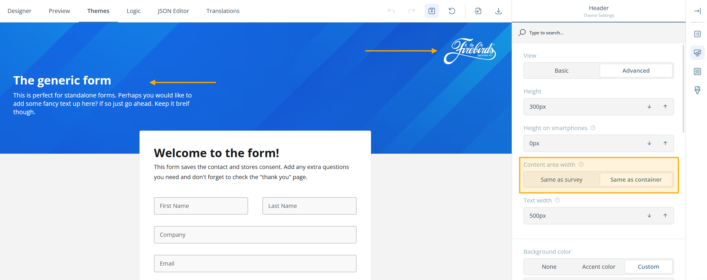

## Background options

You can style the background behind the whole form, not just the header.

Under the **Background** category:

* **Background color** — pick a color, or enter an RGB, HEX, or HSL value.
* **Background image** — paste a link or click the folder icon to upload a file.
* **Image display** — choose [Auto](#auto), Contain, or Cover.
* **Image position** — toggle between Fixed and Scroll.
* **Opacity** — set how transparent the background appears.

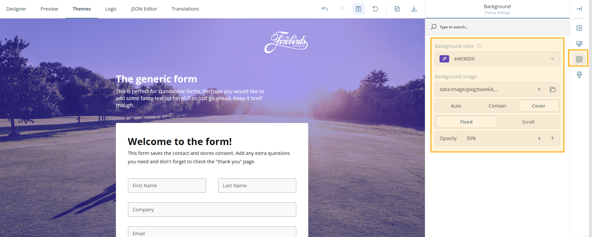

## What to do next

For a tour of the other editor tabs, see [Form editor: UI overview](ui-overview.md).

To style a form embedded on your website with your own CSS, see **Style the form** in [Embed forms on your website](publish-a-form.md#style-the-form).

## Reference

These options appear in several places across the Themes tab. Here is what each one means.

Accent

A color defined in the theme's appearance settings. It is applied to accented elements throughout the form, such as button colors and the border on a focused field.

Auto

Displays the image at its natural size, without scaling it to fit its area.

Contain

Scales the image to fit entirely within its area while keeping its proportions. May leave empty space around it.

Cover

Scales the image to fill its area while keeping its proportions. May crop the edges.

Fill

Stretches the image to fill its area, ignoring its proportions. May distort the image.

Stretch

Stretches the image to fill its area, ignoring its proportions. Has the same effect as Fill.

Tile

Repeats the image across its area until the space is filled.

