# Form editor: UI overview

The form editor has six tabs: Designer, Preview, Themes, Logic, JSON Editor, and Translation. This article explains what each tab does and what question types are available.

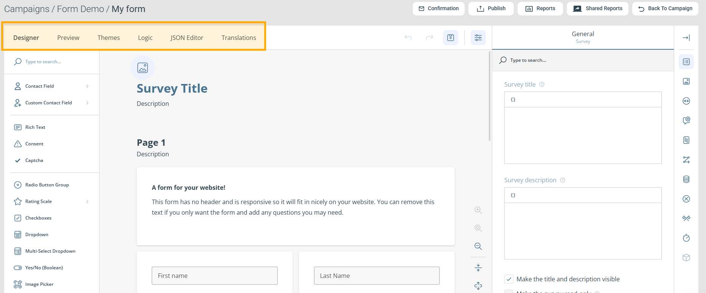

## Designer tab

The Designer tab is where you build your form. It has three main areas: the Toolbox on the left, the design surface in the center, and the Property Grid on the right.

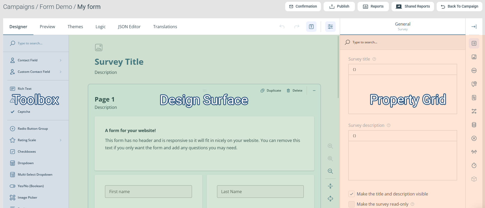

### Toolbox

The Toolbox lists every question type and structural element you can add to your form. Drag an item from the Toolbox onto the design surface, or click it to add it at the end of the current page.

### Question types

Single-choice questions

**Radio button group**
Displays a list of options. Respondents select one.

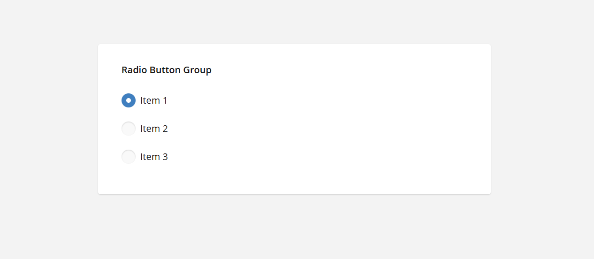

**Dropdown**
A single-select dropdown list. Useful when the option list is long or you want to save space on screen.

**Yes/No (Boolean)**
A toggle that returns true or false. Renders as a switch, radio button pair, or checkbox depending on your theme settings.

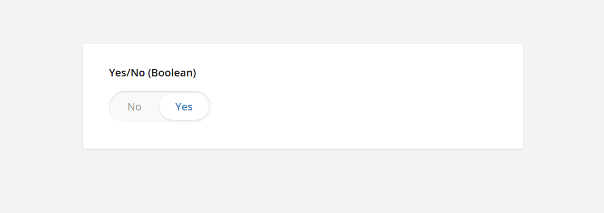

Multiple-choice questions

**Checkboxes**
Displays a list of options. Respondents can select more than one.

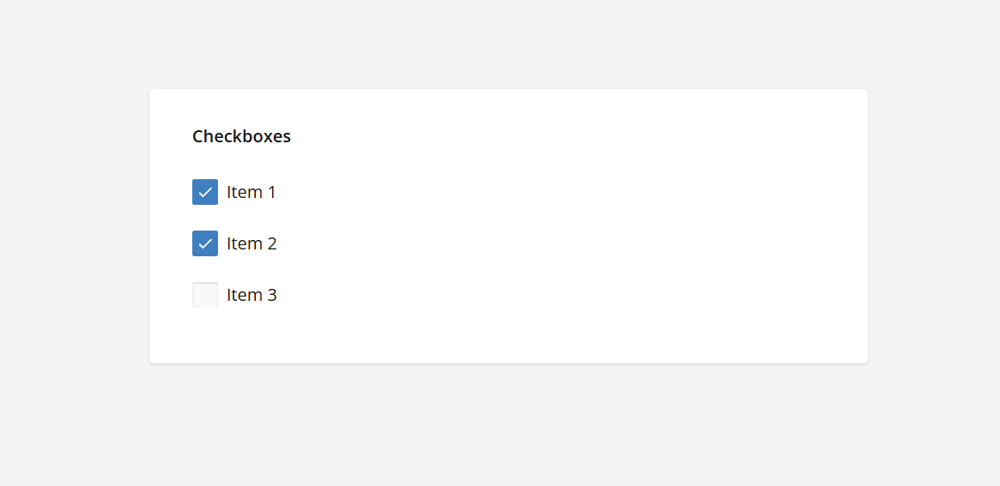

**Multi-select dropdown**
A dropdown that allows multiple selections.

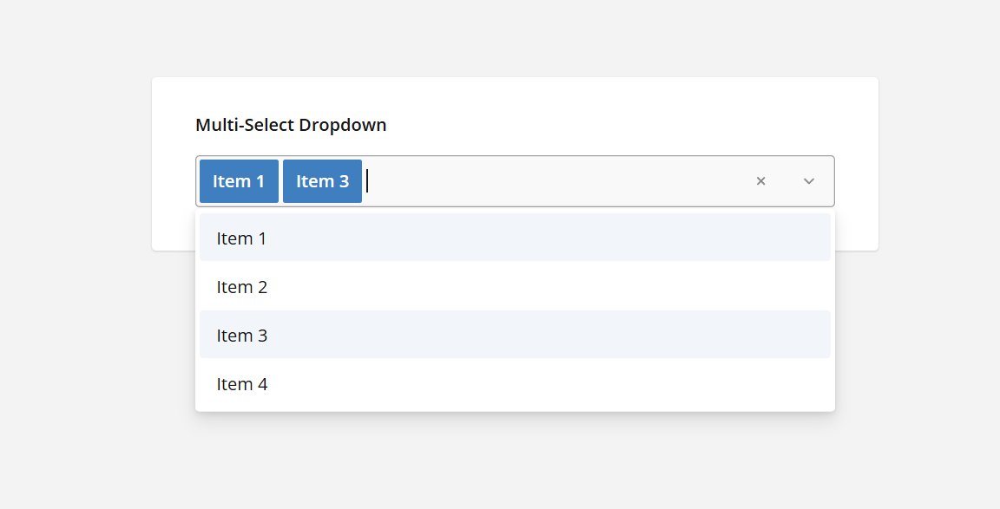

Rating and ranking

**Rating scale**
A numeric range respondents use to rate something. You can replace the numeric labels with star or emoji icons.

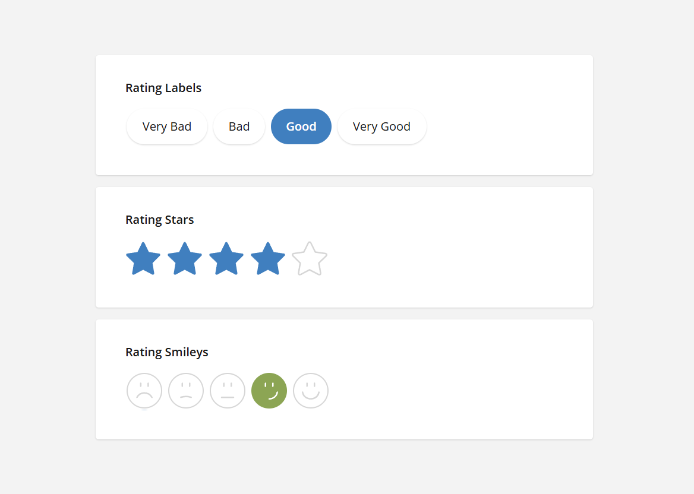

**Ranking**
A drag-and-drop list that lets respondents order items by preference.

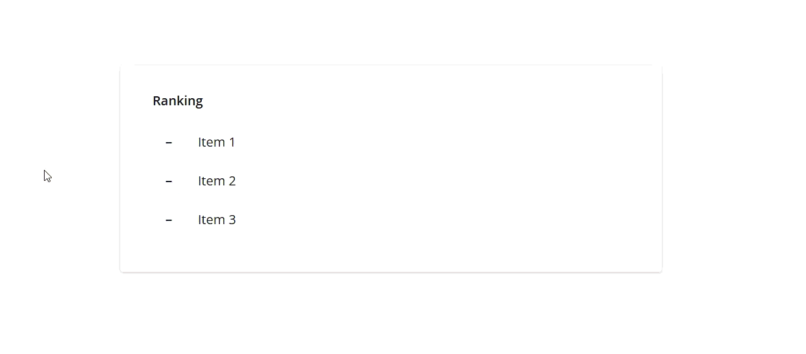

Text input

**Single-line input**
A one-line text field. Also accepts numbers and dates.

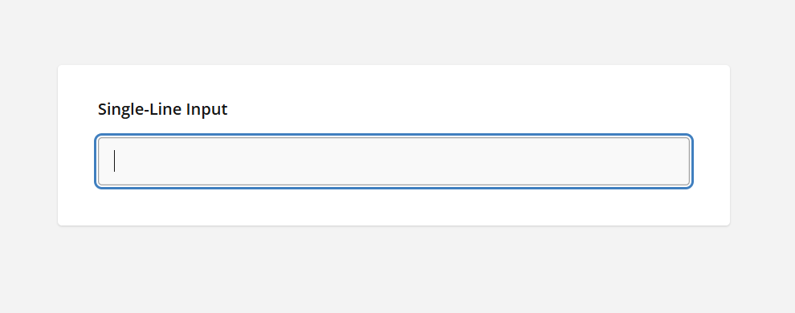

**Long text**
A resizable multi-line text area for longer answers.

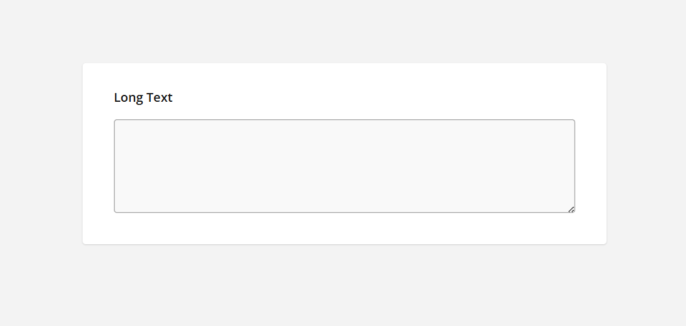

**Multiple text boxes**
Several single-line fields grouped together. Useful when you need a set of short answers under one question.

Image picker

Displays a series of images. Respondents click one (or more, if configured) to select it. Each choice has an associated value.

Matrix questions

**Single-select matrix**
A grid with rows and columns. Each row is a statement or item; respondents select one column choice per row using radio buttons.

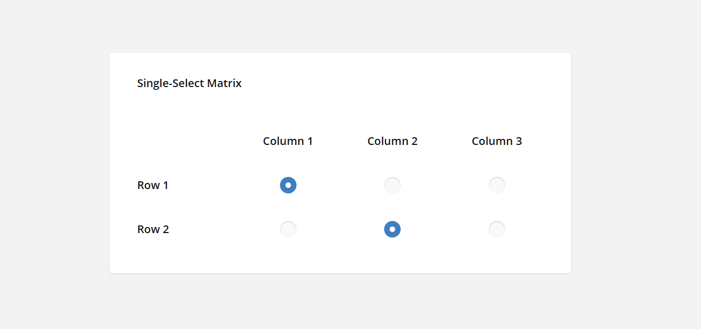

Presentation elements

**HTML**
A block of formatted text you write directly in the editor. Use it for instructions, headings between question groups, or any non-interactive content.

**Image**
Embeds a static image or video in the form. Respondents cannot interact with it.

**Expression**
Displays a calculated value — a sum, average, or concatenation of other answers. Useful on the final page to summarize what the respondent submitted.

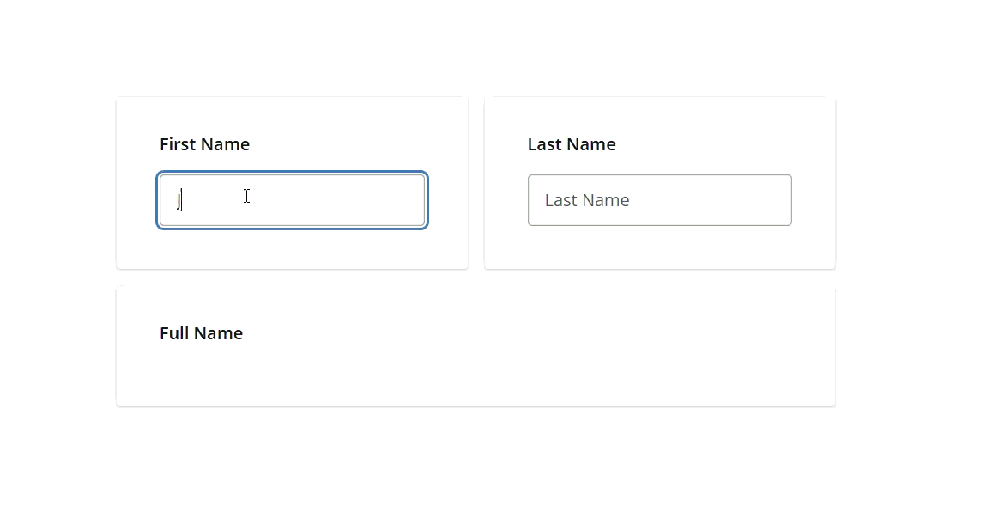

Structure elements

**Panel**
A container that groups questions together visually. Panels can be collapsible and can have their own title and description.

**Dynamic panel**
A repeating panel template. Respondents can add or remove panel instances, which makes it useful for variable-length entries such as multiple contacts or order lines.

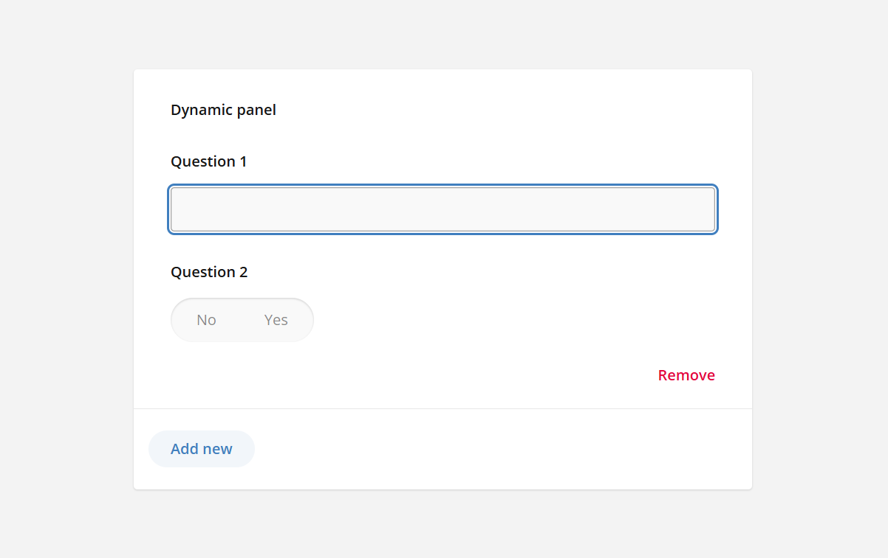

Contact fields

**Contact Field**
A single-line input mapped to a specific field on the contact card. Use it when you want form responses to update the respondent's contact record in eMarketeer.

Data submitted through a Contact field is saved both as form answer data and as contact record data. It overwrites any existing value on the contact card.

A form that includes a **Contact field: Email** will create a new contact or match against an existing one when the form is submitted.

Contact fields are pre-populated from the contact database if the respondent is known — for example, when they open the form through a personalized link.

Available fields: Email, First Name, Last Name, Salutation, Company, Title, Phone number, Mobile phone, Address 1, Address 2, City, State, Zip code, Country, Note.

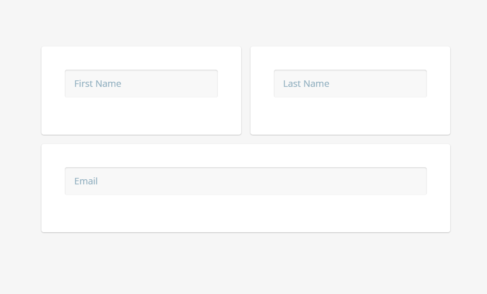

**Custom Contact Field**
Works the same way as Contact Field, but maps to your account's custom contact fields instead of the default contact card fields.

### Adding a question

To add a question, drag it from the Toolbox onto the design surface. You can also click the **Add Question** button at the bottom of a page to insert a single-line input. Click the ellipsis icon next to the button to choose a different type before inserting.

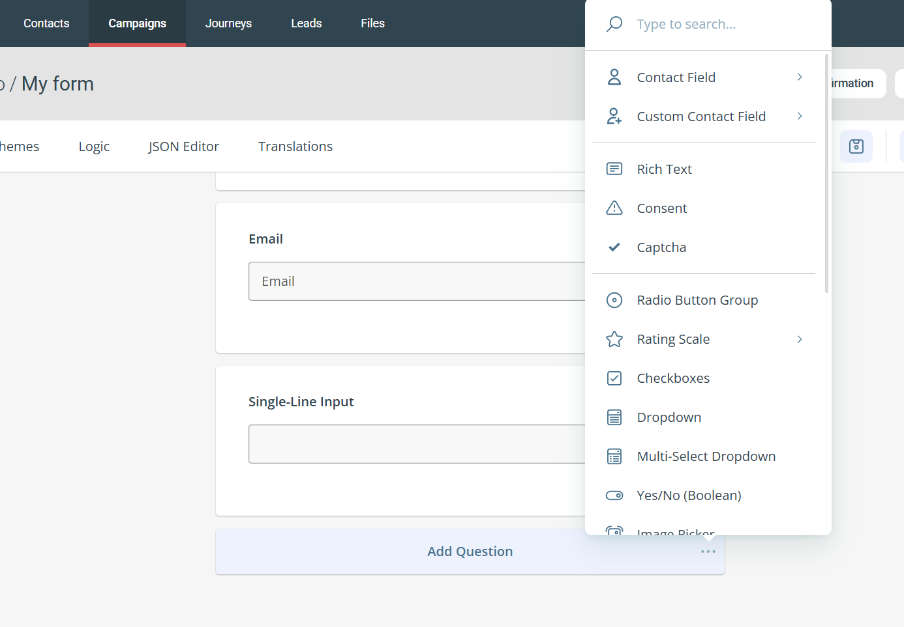

### In-place editing

When you click a question on the design surface, inline editing controls appear directly on it. You can edit the question text, reorder choices, duplicate the question, delete it, or mark it as required — without opening the Property Grid.

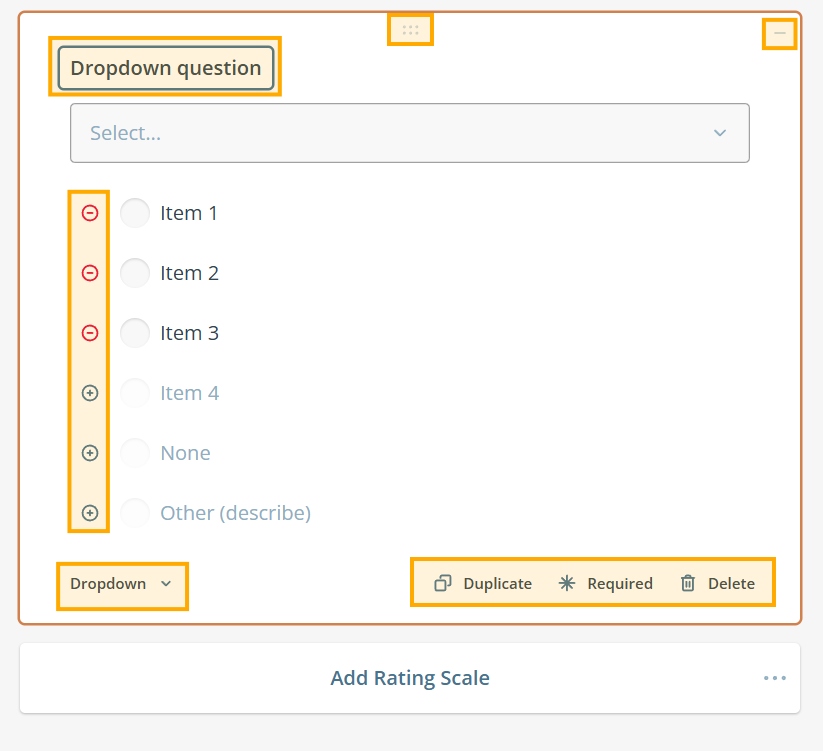

### Property Grid

The Property Grid on the right side of the editor shows configuration options for the currently selected question, page, or form. Options are grouped into categories.

To set a default answer for a question, select it, open the **Data** category in the Property Grid, and click **Set Default Answer**.

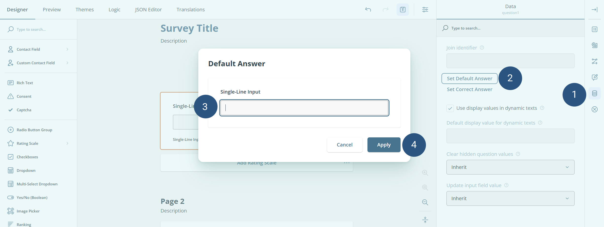

### Page management

A form can have multiple pages. To add a page, select the form, open the **Survey** category in the Property Grid, go to **Pages**, and click **Add new page**. You can also drag a question onto the skeleton page at the bottom of the design surface — this creates a new page automatically.

### Changing question type

To change a question to a different type, use the type selector in the question's toolbar on the design surface. Some conversions lose data — for example, converting a Dropdown to a Single-line input removes the choice list. Undo is available if you want to revert.

## Preview tab

The Preview tab shows the form as a respondent sees it. Fill it in and submit to see how the response data is recorded. After submitting, results appear in a table or as raw JSON. Click **Preview Survey Again** to restart.

Use the device selector to preview on different screen sizes and the orientation toggle to switch between portrait and landscape.

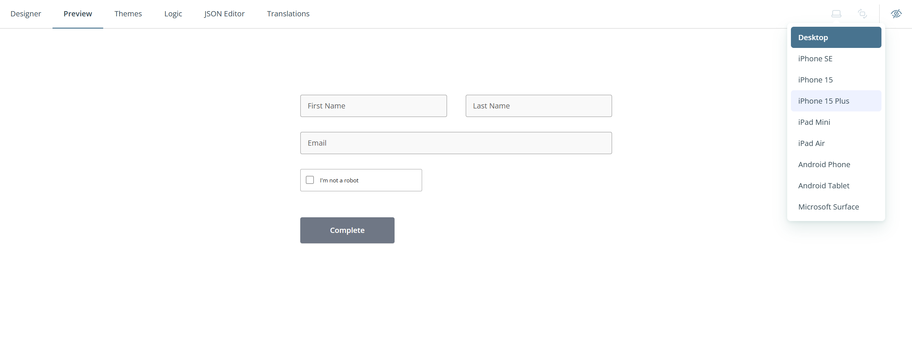

## Themes tab

The Themes tab lets you change the form's appearance — colors, fonts, sizes, corner radius, shadows, and other visual properties.

You can export a custom theme as a JSON file and import it on another form to reuse the same style.

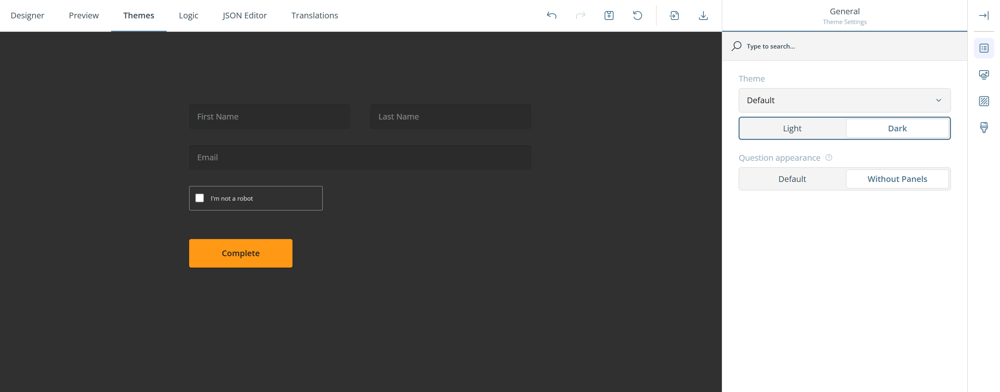

## Logic tab

The Logic tab is where you define conditional rules that control form behavior — for example, showing a question only when a previous answer meets certain criteria.

### Adding a rule

Click **Add New Rule**. Each rule has a condition (if) and one or more actions (then).

**Conditions** — select a question and a logical operation (equals, is empty, contains, and so on). Combine multiple conditions using AND or OR. Use **Manual Entry** to type an expression directly.

**Actions** — what happens when the condition is true. Available actions:

- Show or hide a page or question
- Enable or disable a page or question
- Mark a question as required
- Complete the form
- Set a question's answer
- Copy an answer from one question to another
- Skip to a specific question
- Run a custom expression
- Set the content of the completion page

To edit a rule, click it to expand it, make changes, and click **Done**. Use the Question Filter and Action Type Filter to narrow the list when a form has many rules.

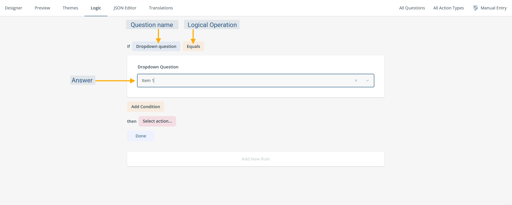

## JSON editor tab

The JSON Editor tab shows the raw JSON configuration of your form. You can edit it directly, but for most changes the Designer tab and Property Grid are easier.

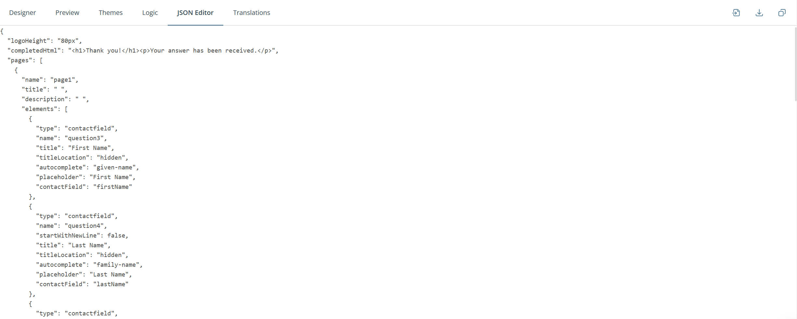

## Translation tab

The Translation tab lists all translatable strings in your form. Use it to provide text in multiple languages so respondents can switch between them.

**Adding a language** — open Language Settings and click **Add** to select a language from the list.

**Filtering** — use the Page Filter to show strings from a specific page. Enable **Used Strings** to show only strings that have been translated.

**Import and export** — use the toolbar buttons to import or export translations as a CSV file.

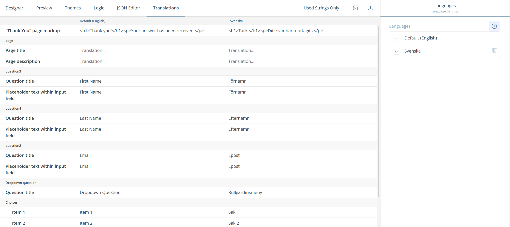

