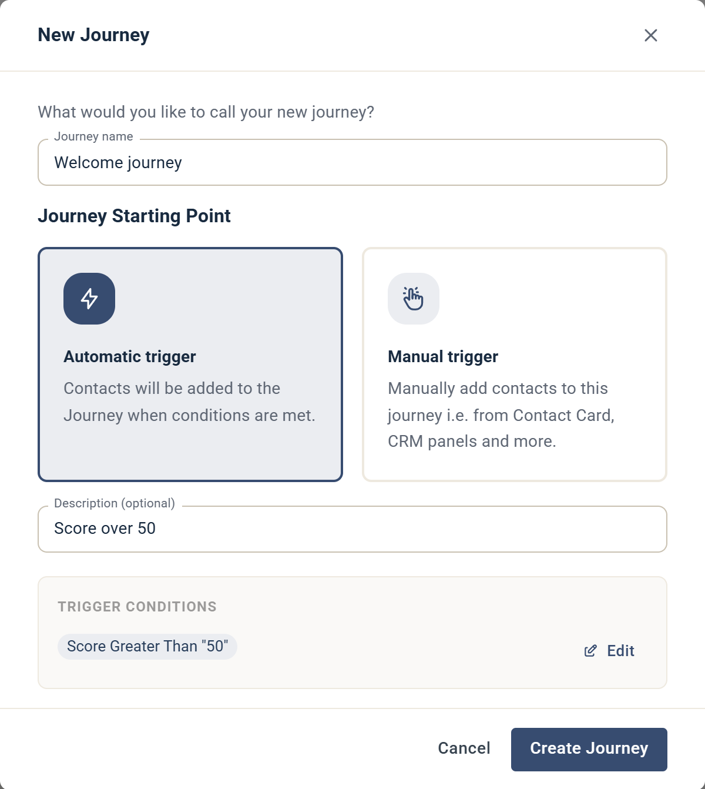
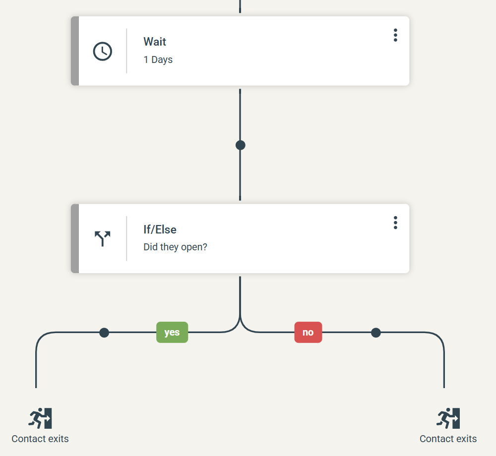
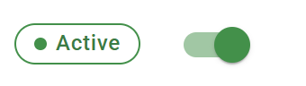

# Creating your first Journey

This article walks through building your first Journey, from starting point to activation.

A Journey is an automated sequence that runs a series of steps for each contact who enters it. The Journey builder lets you combine triggers, waits, branches, and actions.

### Accessing the Journey builder

Click "Journeys" in the left sidebar. Then click "New Journey" to create your first Journey.

### Adding a starting point or trigger

When you create a new Journey, the first task is to name it and choose a starting point. Choose "Automatic trigger" to add contacts when they match conditions, or "Manual trigger" to add contacts by hand, for example from a contact card.

With an automatic trigger, the starting point is a set of trigger conditions. Click "Set conditions", choose a category such as Score, and click "Add condition". Any contact that matches the conditions starts the Journey.


**Note:** The starting point only triggers for contacts that match the filter from the time of activation. It does not include contacts that matched the filter historically.


Once your conditions are set, click "Apply conditions". Then click "Create Journey" to open the Journey editor.

The Journey does not start until you activate it.

For now this is all you need to know about starting points. For a deeper dive, see [this detailed overview on Journey triggering events](journeys-triggering-events.md), which explains exactly when starting points are evaluated.

### Build your Journey

After you set the starting point, you enter the Journey builder. This is where you add the steps (actions) you want to execute for each contact that enters the Journey.

Click a dot on the line between two steps to open the "Add Journey step" panel, then click the step you want. Steps are grouped as Campaign Component, Logic, Lead, Contact and CRM.

### Setting up wait conditions

The Journey builder lets you split the Journey into branches based on criteria you choose.

For example, your Journey can send an email, wait for a day, and then perform different actions depending on whether the email was opened.

Add the wait step first, then add the If/Else step to split the path into branches.


Always add a wait step before an If/Else step, or it will be evaluated immediately.


The If/Else step has its own conditions. Click "Set conditions" to choose the criteria. Once you add the If/Else step, the branch splits into two: one for contacts who meet the criteria, and one for those who do not. Adding a wait step before the If/Else step is especially important when evaluating interactions from a previous step.

You can now continue building each of the two branches.

### Sending emails and SMS

Journey steps include sending emails and text messages (SMS). To use them in a Journey, first create them in a campaign.

You can't create a new email or SMS from inside the Journey. You can, however, add a step that isn't fully configured yet as a placeholder. A Journey with unfinished steps can be saved, but not activated.

Reports for the sent components are also located in the campaign where you built them. You can go directly to the report for an email or SMS by opening the settings menu for the step.

### Save your Journey

Any changes to a Journey must be saved before they take effect. Click "Save" at the top of the left panel to save your Journey.

### Activating a Journey

When you create a Journey, it is paused. While paused, the Journey is inactive and no contacts enter it.

When you are ready to activate your Journey, switch on the toggle under "Status" in the left panel. The label changes from Paused to Active.

When the Journey is active, any new contacts matching the starting point filter enter the Journey.

### Editing a Journey

You can edit a Journey at any time. However, the Journey must be paused before you can make any changes.

When editing is done, save the changes and activate the Journey again.

## Journey settings

### Re-enter Journey

By default, a contact can only enter a Journey once. If a contact matches the starting point again after entering, they are skipped.

To allow a contact to enter a Journey multiple times, check the option "Contact can re-enter Journey".

When checked and saved, contacts can re-enter if they match the starting point filter again. They do not need to complete the Journey.

### Make Journey available on Contact Card

Checking this option adds a manual starting point for the Journey on the contact card. Any user with access to a contact can then start the Journey for that contact directly, without waiting for an automatic trigger.

This is similar to selecting "Manual trigger" as the Journey's starting point, with one important difference: this option can be enabled on a Journey that already has an automatic trigger. Use it when a Journey should have both an automatic and a manual entry point — for example, a nurture sequence that normally starts when a contact fills in a form, but that you also want to be able to start manually for individual contacts.

## Monitoring and analytics

### Tracking Journey performance

The "Journey Summary" in the left panel shows when the Journey was launched and how many contacts are in it. Contacts can have three statuses:

* Contacts started – the number of contacts that matched the starting point filter and entered the Journey.
* Contacts in progress – any contact that started the Journey but has not completed it. Without wait steps, contacts pass through the in-progress status briefly. With wait steps, many contacts can remain in progress at once.
* Completed journeys to date – the number of contacts who completed all steps in the Journey.

### Step counter

Each step in the Journey has a step counter that shows how many contacts have reached that step.

Click the number to bring up a list of the contacts for that step. From there you can export or bulk update them.

The wait step has an additional counter showing how many contacts are currently waiting in that step.

## Journeys and SuperOffice

The **CRM** group in the **Add Journey step** panel contains several actions that perform tasks in SuperOffice:

* Create Activity
* Create Sale
* Add / Remove from project
* Add / Remove from selection
* Add / Remove interest

All tasks relate to contacts in SuperOffice.

Before a step runs, eMarketeer looks up the contact in SuperOffice. To learn how contacts are matched and how missing contacts can be created, see [SuperOffice contact matching](../superoffice/superoffice-contact-matching.md).
