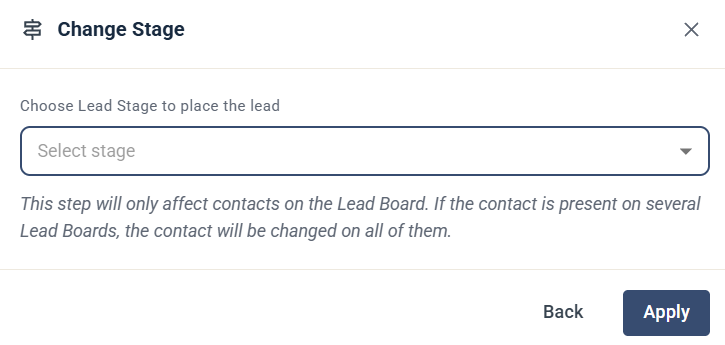

# Change Lead Stage

The Change Lead Stage step moves the contact's lead to another stage.

This is useful in lead nurturing Journeys, to move a lead from MQL to a more significant stage, such as SQL or Opportunity, when it's ready.

## Settings

* **Choose Lead Stage to place the lead** — select the stage the lead is moved to. The stages are:
  * MQL
  * SQL
  * Opportunity
  * Won
  * Lost

Click **Apply** to save the step.

The step only affects contacts on the Lead Board. If the contact is on several Lead Boards, the stage is changed on all of them. See [The lead board](../../knowledge-base/lead-board-scoring/the-lead-board.md).

## Use with SuperOffice sales

If you use SuperOffice, combine this step with the [Sale Sold](../superoffice/superoffice-signals.md#sale-sold) and [Sale Lost](../superoffice/superoffice-signals.md#sale-lost) signals. When a sale is closed in SuperOffice, a Journey started by the signal can move the lead to **Won** or **Lost** in eMarketeer automatically.
