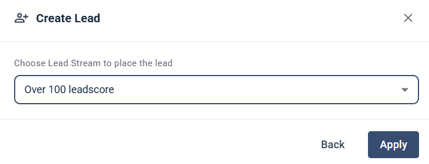

# Create Lead (MQL)

The Create Lead (MQL) step creates a marketing-qualified lead for the contact and places it in a Lead Stream.

## Settings

* **Choose Lead Stream to place the lead** — select the Lead Stream the lead is placed in.

Click **Apply** to save the step.

To learn more about Lead Streams, see [Lead streams](../../knowledge-base/lead-board-scoring/lead-streams.md).
