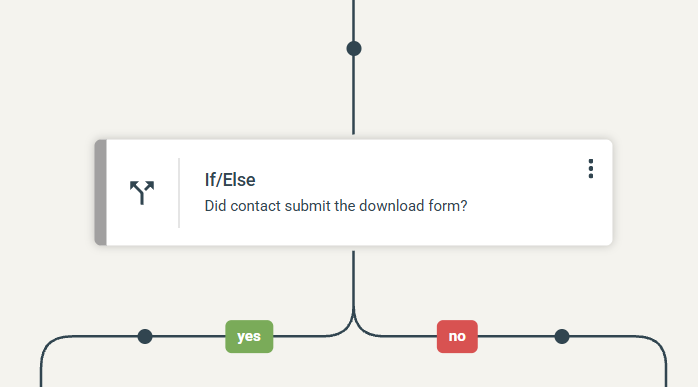

# If / Else

The If / Else step splits the Journey into two branches based on conditions. Contacts who meet the conditions follow the **yes** branch, and the others follow the **no** branch.

## Settings

* **Description (optional)** — a short text that is shown on the step in the Journey builder, so you can see at a glance what the step checks.
* **Conditions** — click **Set conditions** to choose the criteria. The conditions you set are shown in the step. Click **Edit** to change them.

Click **Apply** to save the step.

## Build the branches

After you add the step, the Journey splits into a **yes** and a **no** branch. Add steps to each branch to decide what happens to the contacts on it.


Always add a wait step before an If / Else step, or it will be evaluated immediately. This is especially important when you evaluate interactions from a previous step, such as an email open.


To give the contact time to act first, add a [Wait](journey-step-wait.md) step before the If / Else step.
