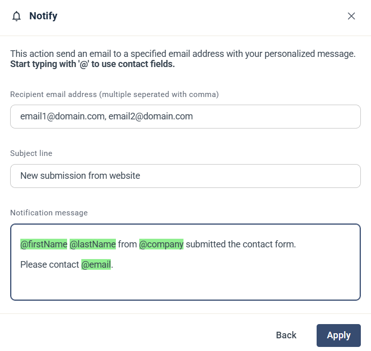

# Notify stakeholder

The Notify stakeholder step sends an email with your own message to one or more email addresses. Use it to alert a colleague, for example when a contact submits a form.

## Settings

* **Recipient email address** — the address to send the notification to. Separate several addresses with commas.
* **Subject line** — the subject of the notification email.
* **Notification message** — the text of the email. Type `@` to insert a contact field, such as the contact's name, company or email address. The field is filled in with the details of the contact who reaches the step.

Click **Apply** to save the step.
