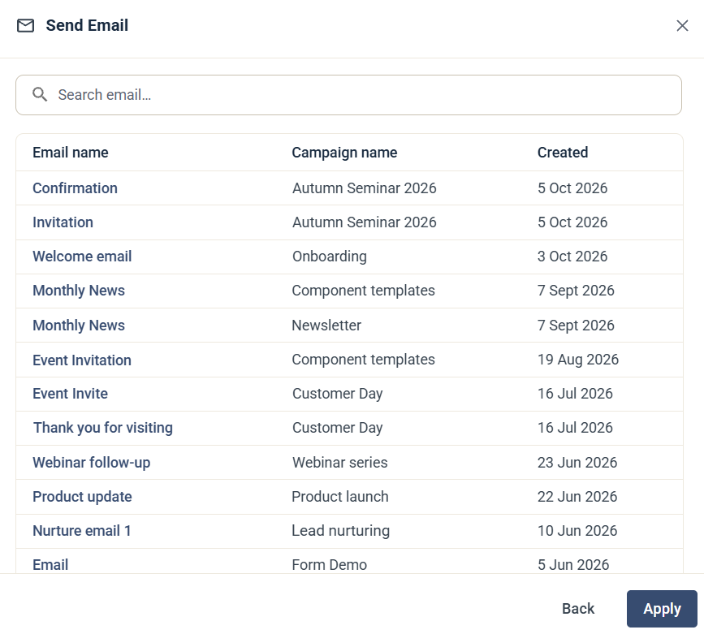
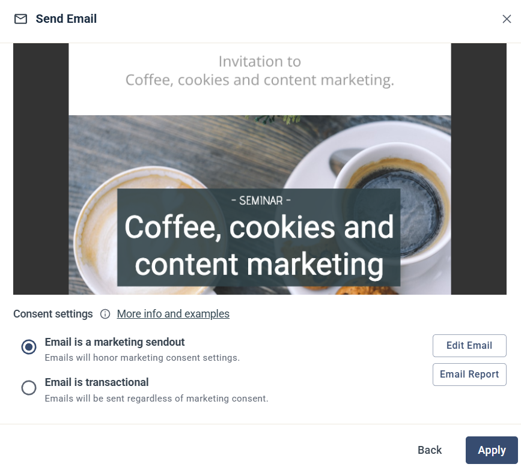

# Send Email

The Send Email step sends an email to the contact. The email must already exist in a campaign: you can't create a new email from inside a Journey.

## Choose the email

When you add the step, a list of your emails opens. It shows each email's name, the campaign it belongs to and when it was created. Search by name if the list is long, and click the email you want.

## Settings

After you choose an email, the step shows a preview of it.

**Consent settings:** choose how the email relates to marketing consent.

* **Email is a marketing sendout** — the email honours the contact's marketing consent settings.
* **Email is transactional** — the email is sent regardless of marketing consent.

**Edit Email** takes you to the email, and **Email Report** to its report.

Click **Apply** to save the step.

## Good to know

* You can add the step before the email is ready, as a placeholder. A Journey with unfinished steps can be saved, but not activated.
* The report for the email is in the campaign where you built it.
