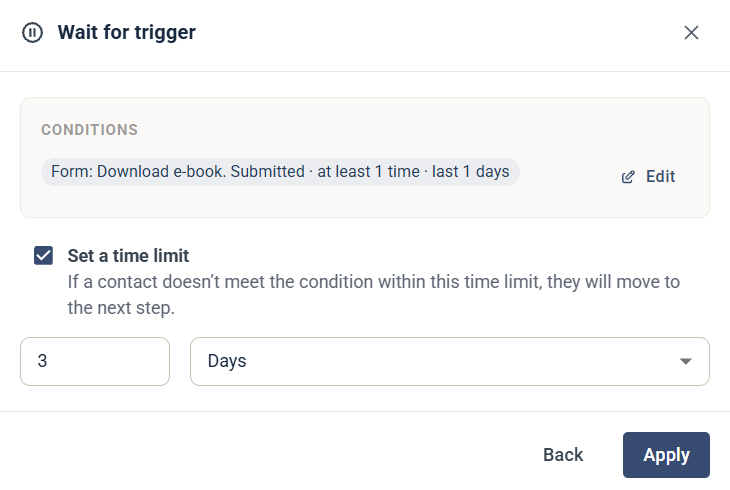

# Wait for trigger

The Wait for trigger step holds the contact at this step until they meet a set of conditions. The contact then moves on to the next step.

## Settings

* **Conditions** — click **Set conditions** to choose what the contact must do or match, for example submit a form. The conditions you set are shown in the step. Click **Edit** to change them.
* **Set a time limit** — optional. If the contact doesn't meet the conditions within the time limit, they move to the next step anyway. Enter a number and choose a unit, such as hours or days.

Click **Apply** to save the step.
