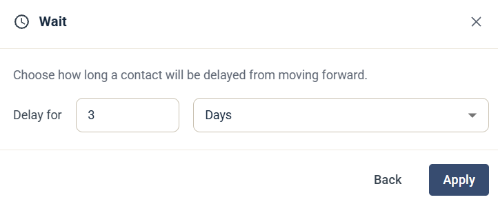

# Wait

The Wait step pauses the contact for a set amount of time. When the time has passed, the contact moves on to the next step.

## Settings

* **Delay for** — enter a number and choose a unit, such as days.

Click **Apply** to save the step.

A Wait step is often placed before an [If / Else](journey-step-if-else.md) step, to give the contact time to act before the condition is checked.


Always add a wait step before an If / Else step, or it will be evaluated immediately. This is especially important when you evaluate interactions from a previous step, such as an email open.

