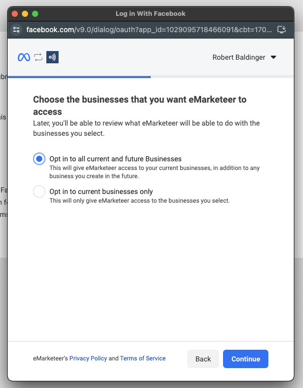
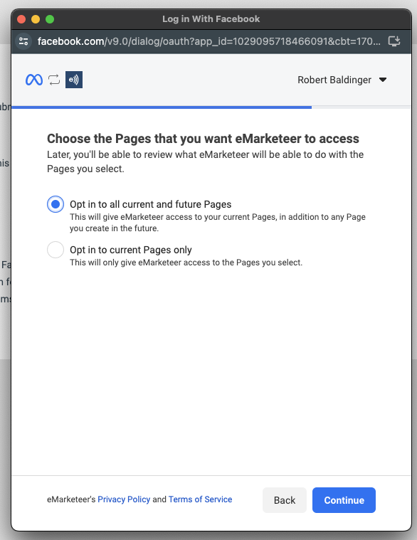
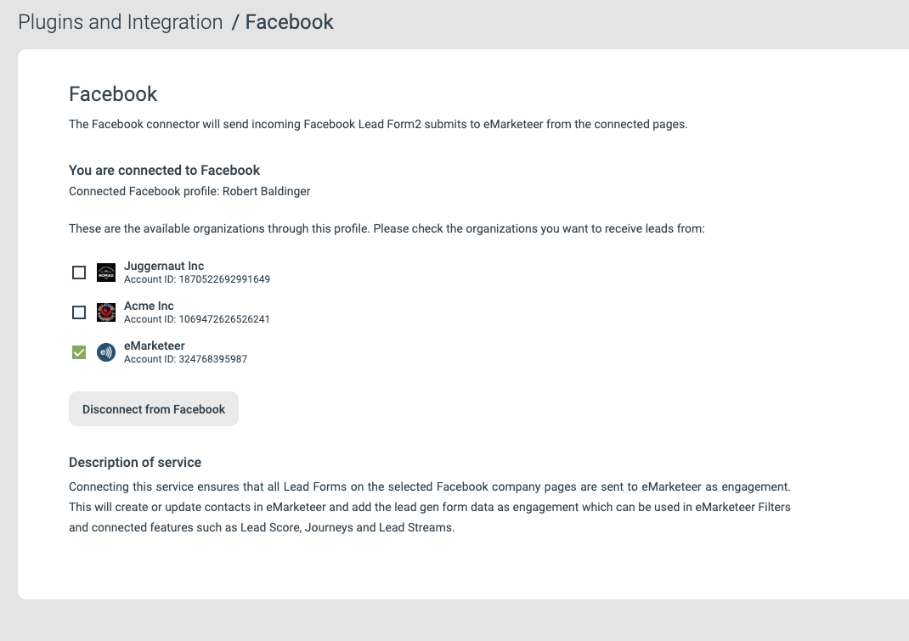

# Facebook Lead Forms

Connect Facebook Lead Forms to eMarketeer so ad submissions create contacts, set lead scores, and trigger journeys automatically.

When you advertise on Facebook, you can attach a Call to Action to your ads to collect registrations, leads, and sign-ups. The eMarketeer Facebook connector sends every Lead Form submission directly into eMarketeer.

## Requirements

* A Facebook business entity with access to one or more pages.
* A Facebook personal profile with access to that business.

[Read more about creating Lead Forms on Facebook here](https://www.facebook.com/business/help/397336587121938?id=735435806665862).

## What the connector does

Once connected, submissions can:

* Create and update contacts.
* Set lead score.
* Trigger journeys.
* Send leads to sales.

## Get started with Facebook Lead Forms

First, make sure you have one or more Businesses on Facebook.

As an admin in eMarketeer, click "Settings", "Plugins and integrations", and "Facebook". Click "Connect to Facebook" to start the connection.

In the Facebook popup, log in with your personal profile to identify yourself.

Next, choose which businesses you want to receive leads from. You can pick any business you have access to.

Click "Continue". From the selected businesses, pick the pages you want to connect. You can choose all pages or specific ones.

Finally, agree to the eMarketeer permissions and save the connection.

You are now connected.

eMarketeer lists the businesses it has access to. Your last step is to check which businesses you want to receive leads from. You can enable or disable each one at any time on this page.

## Receiving leads

To send leads to eMarketeer, you need to create ads in your Meta Business account. [Read more on Facebook](https://www.facebook.com/business/help/375478503258484?id=735435806665862).

Once your lead ads are live, [use this tool](https://developers.facebook.com/tools/lead-ads-testing/) to test-submit your forms without publishing the ads.

When any submission arrives, real or test, it is sent to eMarketeer automatically. You will find these contacts under Contacts in the Engagement filter.

## Process incoming leads from Facebook

Once leads start arriving and you see your test in the Engagement filter, you can process them. You can:

* Set lead score.
* Start journeys.
* Create leads on the Lead Board.

## Troubleshooting

### Meta Lead Ads Testing tool gives an error and no leads arrive in eMarketeer

When you create a [test lead](https://developers.facebook.com/tools/lead-ads-testing/), the status column should show "Success". If it shows "Failed" with the "CRM access" error below, you need to give eMarketeer access to your leads.

.png>)

To fix it:

1. Log in to [https://business.facebook.com](https://business.facebook.com) and choose the business account you want leads from.
2. In the left menu, open Settings (the cog wheel), then "Integrations", then "Lead Access".
3. Pick the page you want to get leads from.
4. Open the "CRM" tab (alongside "People" and "Partners").
5. If "eMarketeer" is not in the list, click "Assign CRM" and add it.

eMarketeer now has access to your leads. Try the Meta Lead Ads Testing tool again and it should work.
