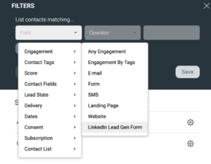

# LinkedIn Lead Gen Forms

Connect LinkedIn Lead Gen Forms to eMarketeer so ad submissions create contacts, set lead scores, and trigger journeys automatically.

When you advertise on LinkedIn, you can attach a Call to Action to your ads to collect registrations, leads, and sign-ups. [Read more about Lead Gen Forms on LinkedIn here](https://business.linkedin.com/marketing-solutions/native-advertising/lead-gen-ads).

By default, LinkedIn lets you download submitted leads as a CSV file that you process manually. With the eMarketeer LinkedIn connector, every Lead Gen Form submission is sent straight into eMarketeer where it can:

- Create and update contacts.
- Set lead score.
- Trigger journeys.
- Send leads to sales.

## Get started with LinkedIn Lead Gen Forms

### Connect eMarketeer to LinkedIn

As an admin in eMarketeer, click "Settings", "Plugins and integrations", and "LinkedIn". Click "Connect to LinkedIn" to start the connection.

Note: you connect with your personal LinkedIn profile, which gives eMarketeer access to the Ad Accounts that profile has access to. Connect with a profile that has access to the Ad Accounts you want to receive Lead Gen Form submissions from.

Once connected, you will see the list of Ad Accounts available to receive leads from.

Check the Ad Accounts you want to receive leads from. Checking an Ad Account automatically sends incoming leads from any Lead Gen Form on that Ad Account to eMarketeer.

## What is sent to eMarketeer when a LinkedIn Lead Gen Form is submitted?

When you build a Lead Gen Form on LinkedIn, you choose up to 12 profile data fields that can be sent with the lead. You can also add custom questions to the form, including checkboxes, dropdowns, and text fields.

All data submitted in the LinkedIn form is sent to eMarketeer and shown on the timeline event.

## New contacts created from LinkedIn

When eMarketeer receives a lead from LinkedIn, it matches the contact on email address. If the email already exists, the contact is updated with the new information. Otherwise, a new contact is created.

Note: make sure you do not reach your account's contact limit. If the limit is reached, no new contacts can be created.

These are the fields eMarketeer uses from LinkedIn (when submitted) to create or update contacts:

- Email
- FirstName
- LastName
- Phone
- City
- ZipCode
- Country
- State
- Title
- Company

Any other submitted information is shown on the timeline event on the contact card.

## How to test a lead form on LinkedIn

LinkedIn forms can only be used in a paid, published ad, but there is a way to test leads before you publish.

First, create the form and the ad in LinkedIn. Then click "Preview" on the ad. From the preview, you can submit the Lead Gen Form, and the test lead is sent to eMarketeer. This lets you prepare and test scores, journeys, and lead qualification before launching the ad on LinkedIn.

[Read more about testing leads on LinkedIn here.](https://www.linkedin.com/help/lms/answer/a420737)

## Processing the incoming leads

Once leads arrive in eMarketeer, you can access them through the Contact Filter as Engagement.

Using this filter, you can retrieve all contacts who:

- Submitted any LinkedIn Lead Gen Form.
- Submitted a specific Lead Gen Form.
- Answered the form in a specific way.

Because this engagement is part of the Contact Filter, you can use the same selections in:

- Contact Lead Score.
- Journeys, as a starting point or as an if/else condition.
- Qualifying leads for the Lead Board.
