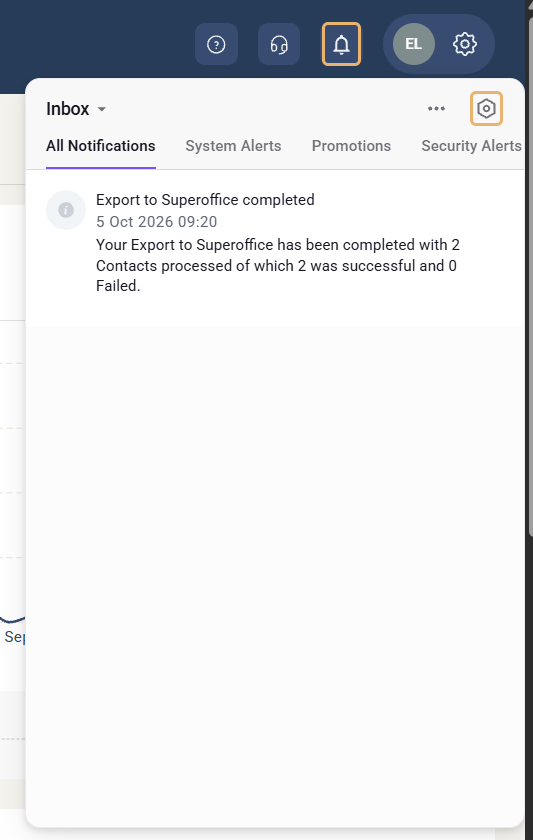

# Notification system

eMarketeer notifies you about problems in your account and about tasks you have started, both in the notification center and by email.

This article lists the notifications by category and shows how to turn off the ones you don't want. For example, you can stop getting an email every time a bulk action finishes.


These are eMarketeer's own notifications about your account and your tasks. Notifications about contacts that you set up yourself, with the [Send notification](../knowledge-base/campaigns/campaign-automation-send-notification.md) campaign automation or the [Notify stakeholder](journeys/journey-step-notify-stakeholder.md) Journey step, are set in the campaign or Journey, not here.


## The notification center

Click the bell icon in the top bar to open the **Inbox**. It lists your notifications, newest first. Many notifications have a button that takes you to the right page, for example **View report** after a contact import.

## Notification categories

Every notification belongs to one of three categories. You can turn email and in-app notifications on or off for each category.

### System Message (High Prio)

Problems that stop something from working. They are sent to every user in the account.

| Notification | When it's sent | Button |
|---|---|---|
| LinkedIn integration issue detected | The LinkedIn integration fails. The notification includes the reason. | Check Integration |
| Facebook connection expired, Facebook integration issue, Facebook page access expired, Facebook webhook authentication failed | The Facebook connection expires, the integration fails, page access expires or webhook authentication fails. | Reconnect Facebook |
| Domain Verification Failed – Email Sending Not Working | The daily check finds that the DKIM or SPF record of one of your [email domains](../knowledge-base/email-deliverability/authorize-email-domain.md) fails. | Review Email Domains |

### System Message (Low Prio)

Status updates and recommendations. Notifications about integrations and email domains go to every user in the account. Import and export notifications go only to the user who started the import or export.

| Notification | When it's sent | Button |
|---|---|---|
| LinkedIn integration recovered | The LinkedIn integration works again. | View Integration |
| Facebook connection restored | The Facebook connection works again. | View Integration |
| Domain Configuration Recommendation | An email domain is missing only its DMARC or MAIL FROM record. | Review Email Domains |
| Email delivery issue | You send from an email domain that isn't verified for sending. Sent once per domain. | Email domain settings |
| Contact import completed, Contact import failed, CRM import completed | A [contact import](../knowledge-base/contacts-lists/import-contacts-from-excel.md) or an import from your CRM finishes or fails. | View report |
| Contact export completed | A contact export is ready to download. | Download |

### Information

Results of tasks you started. These notifications have no button and go only to you.

| Notification | When it's sent |
|---|---|
| Export to SuperOffice completed (shows the name of your CRM) | An export of contacts to your CRM finishes. |
| CRM export completed, CRM export failed | A CRM export finishes with contacts that had no match, or fails. |
| Bulk action completed, Bulk action failed | A [bulk action](../knowledge-base/contacts-lists/bulk-actions-tool.md) on contacts finishes or fails. |
| Campaign copy completed | A campaign you copied is ready. |

## Turn notifications on or off

All notifications are on by default, both by email and in-app. To change this:

1. Click the bell icon in the top bar.
2. Click the hexagon icon in the **Inbox** header to open **Preferences**.
3. Under the category, turn **Email** or **In-App** off or on.

For example, to stop the emails you get when a bulk action finishes, turn off **Email** under **Information**. The notifications still appear in the Inbox.

**Global preferences** turns a channel off completely, for every category. Turning off **Email** there stops all notification emails.
