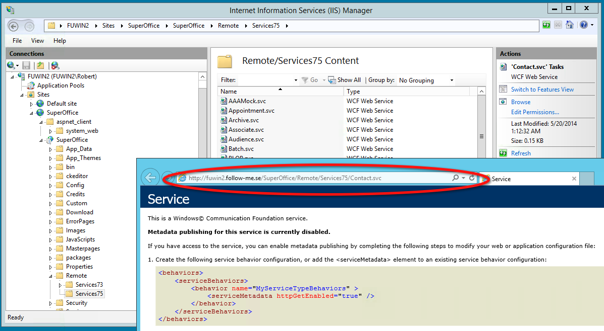

# On Premise: NetServer URL and user creation

For the integration to work, the following conditions must be met

-   NetServer must be installed on your server and eMarketeer needs access to it over HTTP (port 80, 8080 or 443).
-   Exposed NetServer must be the following versions
    -   /services84
-   A SuperOffice user for the integration, one of the following must be met
    -   User is a licensed user with Sales or Complete license
    -   User is “Other user”
-   SuperOffice REST API must allow GET, POST, PATCH, DELETE operations.

### REST and SOAP API

The integration is built on the SuperOffice REST API, however the /services84 still needs to be available since it’s still used for authentication.

### Allowing eMarketeer to access your server

Unless your NetServer is publicly exposed, you need to make sure eMarketeer can access it. Security measures may be to restrict access by firewall.

**Firewall**

All communication will come from the same server at eMarketeer which enables you to set your firewall rules accordingly.

| IP address | Host name | Ports |
| --- | --- | --- |
| 
54.155.30.167

 |  n/a | 80,8080,443 |

_Note: The IP address can’t be pinged._ 

### Retrieving the WSDL URL from your IIS

eMarketeer needs an URL which points to the directory where the NetServer web service functions are located. To find this URL, do the following:

1.  Open IIS on your server
2.  Open the “Sites” tree in the left panel and locate the site which holds your NetServer.
3.  Among the subfolders on your site there should be a folder called “Services84” or similar depending on version.
4.  Once you find the folder it should be filled with \*.svc files. Click the “Content view” button to see that it contains such files.
5.  To get the URL for thesvc-files, right-click on “Contact.svc” and select “Browse”.
6.  This opens the file in your web browser with the complete path to the directory.

This (except the filename) is the correct WSDL URL to be used in eMarketeer.

Example: https://www.yourcompany.se/SuperOffice/Remote/Services84/

**Note:** If the domain name in your URL is “localhost” it needs to be replaced with the correct domain name.

Save this URL for later. Now lets create the user.

### Creating the integration user

eMarketeer needs to log on to NetServer using a SuperOffice user. There are two options for this.

-   Create an “Other” user
-   Use a licensed user

The recommended method is to create an “Other” user since this does not take up one of your user licenses. Note that “Other” user is not available in the web admin, only the desktop admin.

To create a “Other” user, in SuperOffice Admin click to manage users. On that page there is a tab called “Other” which you click. From there you can create a new user and give it a username and a password.

You can also use a licensed user to connect with eMarketeer. Create a new SuperOffice user (not windows user) and make sure is has “user level 0 (zero)”.

Remember the username and password.

Now that we have the URL and user credentials, we’re ready to activate the integration.
