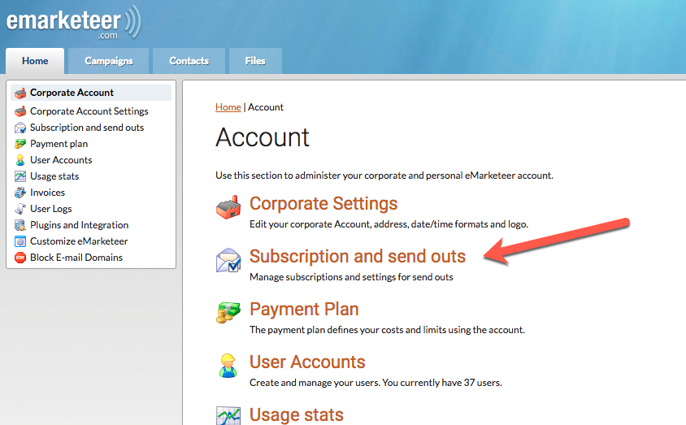
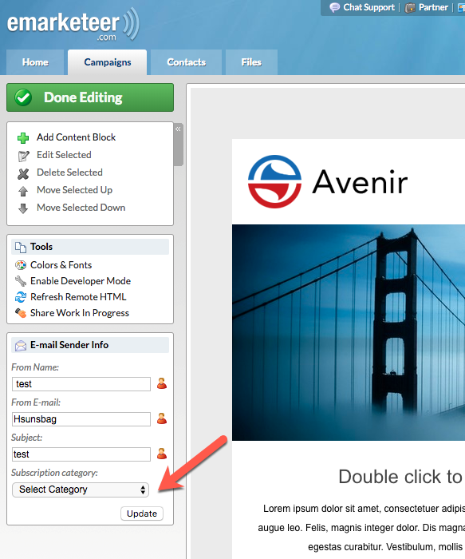

# Subscriptions

Subscriptions let contacts fine-tune which types of email they receive from you, instead of having to unsubscribe from everything. This article explains how subscriptions work and how to set them up.

Offering granular choice improves the contact's experience and reduces full unsubscribes.

## How subscriptions work

A subscription setup is a list of categories, one for each type of communication you send.

For example:

- Newsletters
- Event invitations
- Special offers

Every time you send an email, you choose which subscription category it belongs to. When the email is sent, eMarketeer skips any contact who has unsubscribed from that category. The same contact may still receive emails in other categories.

The subscription categories are shown in the subscription centre (the public unsubscribe page).

You can also send an email with no subscription category. In that case, only total unsubscribes are excluded.

## Set up subscription categories

Administrator privileges are required.

If you do not configure subscriptions, eMarketeer works as before and only offers total unsubscribe to contacts.

1. In eMarketeer, go to **Account** and find **Subscription and send outs**.

   

2. On the subscriptions page, create or manage your categories.

   

When you create subscriptions, keep these guidelines in mind:

- The category name is shown to contacts. Keep names short and clear.
- Keep the list short and avoid being too specific. Use one category per type of send your audience would want to manage.

Once created, subscriptions are available in eMarketeer and on the public subscription centre.

## Subscriptions on your contacts

Subscriptions appear on every contact card in eMarketeer. All subscriptions are set to ON for existing and new contacts. It is up to the contact to turn any subscription off in the subscription centre.

You can also use bulk update to set subscriptions on or off for a selection of contacts.

## Choose a subscription when creating an email

When you create a new email from a template, you see a new setting: the subscription droplist.

Select the category that matches the type of email you are sending.

If you send an email that does not fit any existing category, set the category to **none**. Every contact who is not totally unsubscribed (legal basis = withdrawn) receives it.

When you copy an existing email, the copy inherits the subscription of the original. You can change it while editing.

## Subscription centre

You do not need to change anything in your templates to use the new subscription centre. It is the existing unsubscribe page with added options to manage subscriptions. To unsubscribe fully, the contact checks **Unsubscribe from all future sendouts**, which withdraws marketing consent and stops all emails.

## Automations

New automations are available to set and unset subscriptions, and can be used on any component event.
