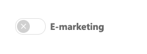

# Import contacts from SuperOffice CRM

When you import contacts from a SuperOffice CRM selection or project, you can include or exclude contacts that lack consent for e-marketing.

In SuperOffice CRM, each contact has a "master switch" for e-marketing on the interests tab. We call this the "e-marketing consent switch".

If the contact has no legal basis for e-marketing emails, the switch is off (gray). If the contact has a legal basis that allows e-marketing, the switch is on (green).

## Choose which contacts to import

When you import SuperOffice CRM contacts into eMarketeer, you can skip or include contacts whose e-marketing switch is off.

* If the checkbox is selected, only contacts with the e-marketing switch on are imported.
* If the checkbox is not selected, all contacts in the selection or project are imported.

## How contacts are identified

Imported contacts are identified in eMarketeer by their primary email address, not the Person ID that SuperOffice uses internally. If the email is not already in eMarketeer, a new contact card is created using that email as the identifier.
