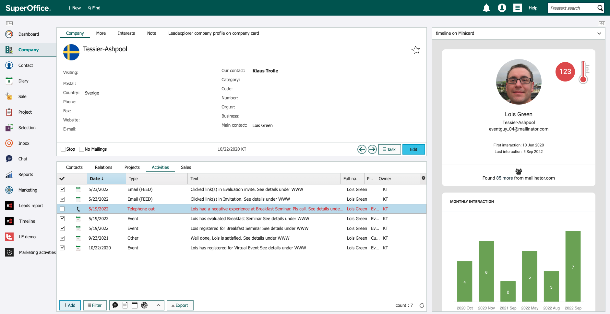
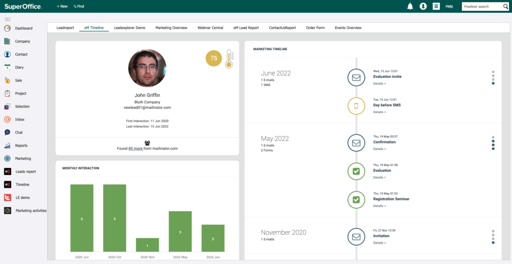
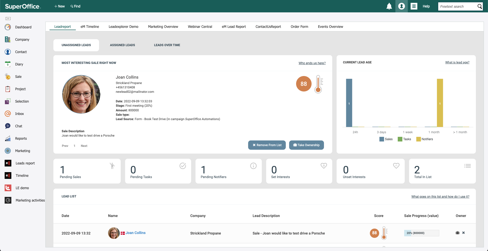

# The SuperOffice Integration - features and flows

The eMarketeer integration for SuperOffice CRM connects marketing activity to the CRM so sales sees lead and engagement data without manual handoffs.

This article explains the common use cases, how the integration interface works, how contacts move between the systems, what automations can do, the available web panels, and how legal basis is handled.

## Common use cases

The integration is used from two perspectives: marketing (the eMarketeer side) and sales (the SuperOffice CRM side).

From a marketing perspective, the integration is most often used to:

* Import SuperOffice segments (selections) for addressing emails.
* Use automations to send events or create objects in SuperOffice CRM, such as:
  * Create a sale.
  * Create activities (pending or completed).
  * Add or remove contacts from selections or projects.
  * Add or remove interests.

From a sales perspective, the integration allows SuperOffice CRM users to:

* See information sent from eMarketeer about the contacts. The automations described above can create a sale, activity, or task in the CRM.
* Use the Lead Report (a web panel) which lists all new leads in SuperOffice CRM.
* Get a full history of contact interactions with online content through eMarketeer's Timeline Report.

## Integration interface

eMarketeer connects to SuperOffice CRM using the standard NetServer services. eMarketeer currently uses version 7.5 for backward compatibility.

## Import and export of contacts

### Separate databases

eMarketeer and SuperOffice CRM have separate databases, and they stay separate even with the integration in place. There is no background synchronization of contacts. Contacts are only created by the integration in specific scenarios:

* SuperOffice CRM: eMarketeer creates new contacts (and companies) in SuperOffice CRM only when a SuperOffice user approves it on the eMarketeer Lead Report web panel. Sales or a controller typically monitors this report for new leads. Because eMarketeer generates leads from the web, this screening step makes sure only valid leads reach SuperOffice CRM.
* eMarketeer: New contacts are created in eMarketeer only when you run the import feature. This is commonly done when sending an email to a SuperOffice selection or project.

### Mapped contact fields

The following contact fields are transferred when importing contacts into either system:

* First name
* Last name
* Email
* Telephone
* Mobile
* Title
* Person ID

In SuperOffice, companies can also be created if you opt in. These fields are filled on the company card:

* Company name
* Country
* Category
* Industry

There is no custom field mapping; the standard fields above are used. Beyond these, automations can add or remove interests from contacts.

## Automations

When contacts interact with eMarketeer through emails, forms, apps, and so on, automations can perform tasks in both eMarketeer and SuperOffice CRM. They are triggered by actions such as link clicks, form submissions, and email opens.

When an automation runs, eMarketeer can perform the following actions in SuperOffice CRM:

* Create a new sale.
* Create a task (pending activity).
* Notify a sales representative (completed activity).
* Add or remove a contact from a selection or project.
* Add or remove an interest from a contact.

These activities have been added to SuperOffice by automations from eMarketeer.

## Web panels

Web panels show more information or extend eMarketeer features into SuperOffice CRM. They can be shown or hidden based on the SuperOffice user's group. The following web panels are used in SuperOffice to interact with eMarketeer.

* The Lead Report. The hub for incoming new leads. For example, if an automation is set up to create a new sale, it can only be processed if the contact already exists in SuperOffice. If the contact does not exist yet, it is treated as a new lead and listed on the Lead Report. Sales uses this report to bring new data into SuperOffice.
* The Timeline Report. A web panel on the contact card in SuperOffice CRM. It shows every interaction the contact had with eMarketeer marketing content, including emails, forms, SMS, and landing pages.
* Event details. When eMarketeer creates a sale or an activity, this panel shows the event that triggered it.

Learn more about your contacts and how they engaged with your marketing content.

This is where all contacts that are not yet in SuperOffice are listed.

## Legal Basis (GDPR)

eMarketeer has its own system for storing legal basis (contact consents and so on). When integrated with SuperOffice Online, legal basis is synced automatically between the systems. For on-premise installations of SuperOffice, there is no sync service, but you can access the eMarketeer legal basis database via API.
