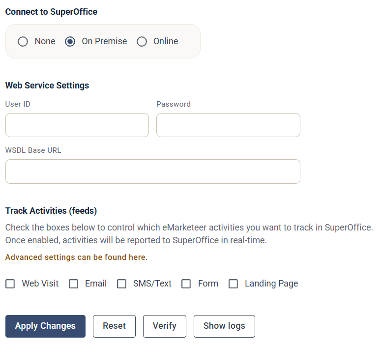

# On premise: enabling the integration

This is the final step of the SuperOffice on-premise integration. Your NetServer must already be reachable from eMarketeer and you need a SuperOffice user dedicated to the integration.

If you have not completed these prerequisites, [follow these instructions](on-premise-netserver-url-and-user-creation.md).

## Enable the integration

Once SuperOffice is ready, complete the rest of the setup in eMarketeer.

1. Sign in to eMarketeer, click the gear icon at the top right, and choose **Account Settings**.
2. Open **Integrations** in the left-hand Account Settings menu, then click **Manage** on the **Superoffice CRM** card.

3. Select **On Premise**.
4. Under **Web Service Settings**, fill in the **User ID** and **Password** of the integration user, and a **WSDL Base URL** pointing to your NetServer SVC-file directory.
5. Click **Apply Changes** to start the integration.

During the integration process, eMarketeer installs items in your SuperOffice instance. [Read more about those actions](actions-performed-during-set-up.md).

When the integration completes successfully, both systems are ready to use.
