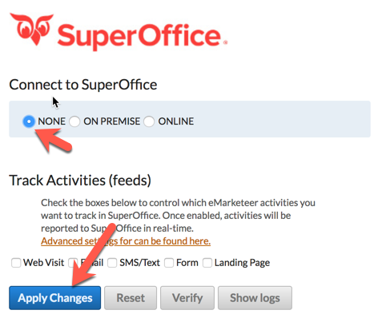

# Reset a SuperOffice integration

## Reset the integration

1. Sign in to your eMarketeer account.
2. Click the gear icon at the top right, choose **Account Settings**, open **Integrations**, and click **Manage** on the **Superoffice CRM** card.
3.  Set the integration to **None** and click **Apply** to save the change.

    

4. The integration is now disabled. Re-enable it by selecting the **ONLINE** or **ON PREMISE** radio button and clicking **Apply Changes** again.
5. Sign in on the SuperOffice login screen and wait for the process to finish.

Your integration is reset and active again.
