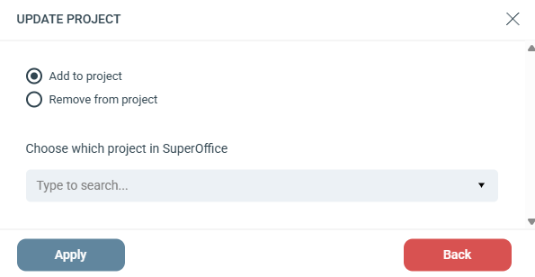

# Add / Remove from project

## Settings

Toggle between **Add to project** or **Remove from project**.

**Choose which project in SuperOffice:** Search for a project in your connected SuperOffice account and select it.
