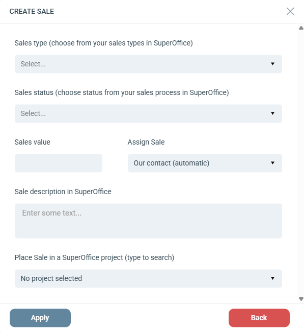

# Create sale

## Settings

**Sales type:** Sets the type of sale. Choose from the available sales types in your connected SuperOffice account.

**Sales status:** Sets the current status of the sale in the sales cycle. Choose from the available statuses in your connected SuperOffice account.

**Sales value:** Sets an estimated value for the sale. The assigned SuperOffice user can update this later.

**Assign Sale:** Assign the sale to a specific SuperOffice user, or use the dynamic **Our contact** option. Our contact is the user assigned to the contact's company under the Our contact field on the SuperOffice company card.

**Sale description in SuperOffice:** A description for the sale. Type @ to insert personalized merge fields. The description also appears in the **Text** column of the Sales tab on Contacts and Companies in SuperOffice.

**Place Sale in a SuperOffice project:** Assign a project to add both the sale and the contact to a SuperOffice project of your choice.
