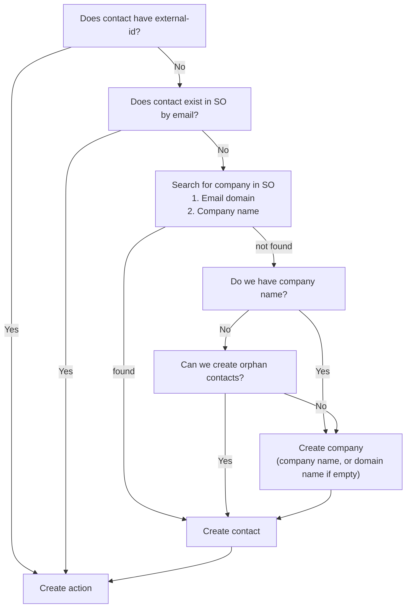

# How contacts are matched between eMarketeer and SuperOffice

This article explains how eMarketeer links a contact to the same person in SuperOffice, and how each part of the integration finds the right contact.

eMarketeer and SuperOffice keep separate databases. A contact in eMarketeer is linked to its SuperOffice counterpart through the **External ID**. Where there is no External ID yet, the contact is matched on email address.

## External ID

External ID is a field on the eMarketeer contact that links it to the contact's record in a connected CRM. It isn't specific to SuperOffice: with Microsoft Dynamics 365, for example, it can hold the Dynamics contact ID. With SuperOffice, it holds the SuperOffice **Contact ID** of the person.

SuperOffice uses two similar IDs, so take care not to mix them up. The **Contact ID** identifies the person (`person_id` in the SuperOffice database), and the **Company ID** identifies the company (`contact_id` in the database). The External ID is always the person's Contact ID.

You can't edit the External ID on a single contact. To set or update it, [import the contacts from SuperOffice](import-contacts-from-superoffice-crm.md). The import matches on email address and saves each contact's Contact ID.

You can also set the External ID with an [Excel import](../../knowledge-base/contacts-lists/import-contacts-from-excel.md) by mapping a column to **External ID**, but importing from SuperOffice is the recommended way. If you use Excel, make sure the column holds the person's Contact ID, not the Company ID.

## When the External ID is set

* **Import from SuperOffice** — The import always matches on email address and updates every eMarketeer contact with that email address, including the External ID. If several contacts in eMarketeer share the same email address, they all end up with identical data, including the same External ID.
* **Share to CRM** — Sharing a contact to SuperOffice creates the contact there, or matches an existing contact by email address. The Contact ID is then saved as the External ID.
* **Lead Board** — When a contact becomes an MQL, eMarketeer searches SuperOffice by email address, uses the first match and saves its Contact ID. See [Lead Board for SuperOffice](../../knowledge-base/lead-board-scoring/lead-board-and-superoffice.md).
* **Journeys** — The SuperOffice Journey steps match the contact by email address, or create it in SuperOffice if you allow it, and save the Contact ID.
* **Excel import** — A column mapped to **External ID**, as described above.

## How each workflow finds the contact in SuperOffice

### SuperOffice automations

[SuperOffice automations](../../knowledge-base/integrations/superoffice-automations-pro.md) in a campaign need the External ID. Without it, the automation is paused and the contact is added to the Manage Automations Queue until the contact is matched or shared to SuperOffice. If the External ID doesn't match any contact in SuperOffice, the automation fails. See [Why did the SuperOffice automation fail?](../../knowledge-base/integrations/integration-queue-failed-automations.md).

### Journey steps

The steps in the **CRM** group of the **Add Journey step** panel first use the External ID. If the contact has none, eMarketeer looks for the contact in SuperOffice by email address. If no matching contact is found, the Journey step is skipped by default. See [SuperOffice Journey Steps](superoffice-journey-steps.md).

## Creating missing contacts in SuperOffice

When you add a Journey step involving SuperOffice, a settings panel appears in the left sidebar.

By default, contacts that are not found in SuperOffice are skipped. You can also configure the step to automatically create the missing contacts in SuperOffice.

To create the contacts in SuperOffice, you must also provide a responsible sales person and a category for the new contacts and companies.

When creating contacts and companies automatically, eMarketeer tries to find an existing company suitable for the new contact, or creates the contact without a company if allowed.

The contact-creation setting applies to all SuperOffice steps in the Journey.

Contact matching logic


When you enable automatic contact creation, it is good practice to also add the new contacts to a selection in SuperOffice. That way you can easily find them later.

