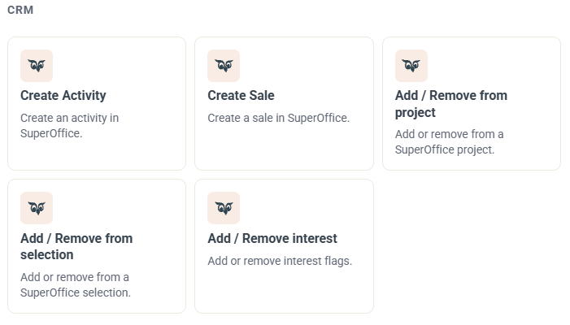
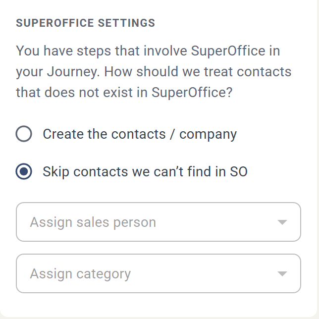
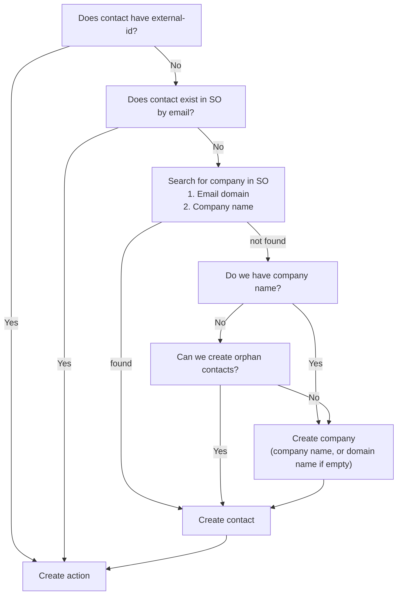

# SuperOffice contact matching

When a Journey step performs a task in SuperOffice, eMarketeer first has to find the contact in SuperOffice. This article explains how contacts are matched and how you can create the contacts that are missing.

It applies to the steps in the CRM group of the "Add Journey step" panel: Create Activity, Create Sale, Add / Remove from project, Add / Remove from selection and Add / Remove interest. See [SuperOffice Journey Steps](superoffice-journey-steps.md).

## Contact matching

When a task is performed in SuperOffice, eMarketeer first checks whether the contact exists there. This is done by matching the external-id and email address of the contact.

If no matching contact is found, the Journey step is skipped by default.

## Creating missing contacts in SuperOffice

When you add a Journey step involving SuperOffice, a settings panel appears in the left sidebar.

By default, contacts that are not found in SuperOffice are skipped. You can also configure the step to automatically create the missing contacts in SuperOffice.

To create the contacts in SuperOffice, you must also provide a responsible sales person and a category for the new contacts and companies.

When creating contacts and companies automatically, eMarketeer tries to find an existing company suitable for the new contact, or creates the contact without a company if allowed.

The contact-creation setting applies to all SuperOffice steps in the Journey.

Contact matching logic


**Tip:** When you enable automatic contact creation, it is good practice to also add the new contacts to a selection in SuperOffice. That way you can easily find them later.

