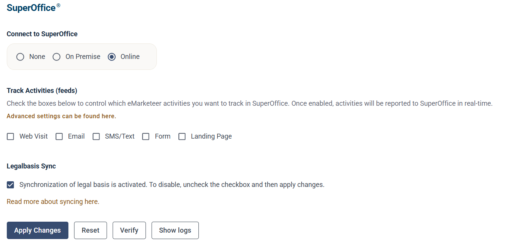

# SuperOffice Online integration

## Requirements

* A SuperOffice Online account (Sales and Complete CRM versions are supported)
* An eMarketeer account

## Actions performed during setup

For the integration to work properly, eMarketeer installs new items in SuperOffice, including web panels, fields, and types. [Read more about these actions](actions-performed-during-set-up.md).

## Start the integration

To start the integration, log in to eMarketeer, click the gear icon at the top right, choose "Account Settings", open "Integrations", and click "Manage" on the SuperOffice CRM card. From there you find the SuperOffice settings page.

1. Select **Online** and click **Apply Changes**.
2. A popup with the SuperOffice login screen appears. Enter your email address, click **Next** and follow the steps to log in.

   

3. Wait while the integration finishes.
