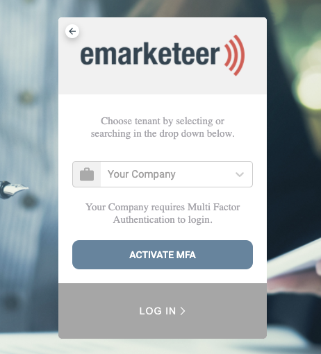
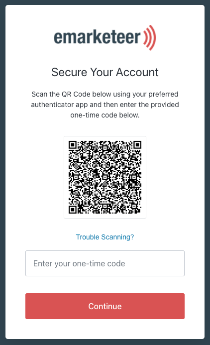
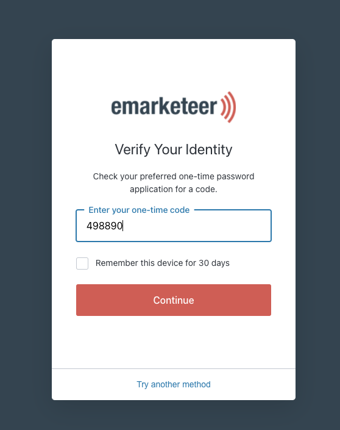

# User guide: Enable Multi-Factor Login

This guide walks you through setting up Multi-Factor Authentication (MFA) for your eMarketeer login using an authentication app.

MFA adds an extra layer of security to your account. To learn more about the feature, see the [Multi-Factor Authentication article](https://support.emarketeer.com/documentation/multi-factor-authentication/).

## Download an authentication app

Before you start, install an authentication app on your mobile device if you don't already have one. We recommend Google Authenticator or Twilio Authy. Use the links below or search for them in your app store.

### Google Authenticator

 

### Twilio Authy 2-Factor Authentication

 

## Set up MFA

Follow these steps after you or your administrator enables MFA on your account. To enable MFA on your own login, go to Settings, then Edit my profile, and click the toggle for MFA.

### 1. Go to the eMarketeer login page

Type your username and password. If you or your account administrator requested MFA, an "Activate MFA" button appears. Click it.

### 2. Set up the app

A QR code appears on the screen. Open the authenticator app on your mobile phone and tap "Scan QR code." Use the app to scan the code on your computer screen. The app then displays a six-digit code. Type this code into eMarketeer and click "Continue."

### 3. Save the recovery code

You are now authenticated, but before you can proceed, eMarketeer shows you a recovery code. Use this code as a backup if you don't have your phone with the authenticator app. Save it and keep it in a secure place. Check the box to confirm you saved it, then click "Continue."

Setup is complete.

## Next time you log in

The next time you log in, eMarketeer shows a "Verify your identity" message. Open your authentication app, read the six-digit code, and type it into the login screen. If you check the box, eMarketeer remembers your identity on this device for 30 days, and you don't need the authenticator app for that period.

If you run into problems logging in, contact support through the chat box on the login page.
