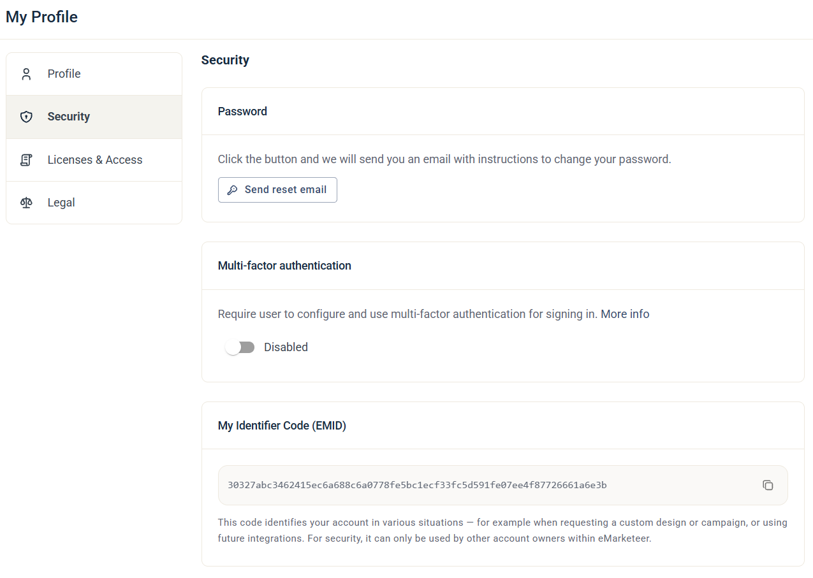

# Edit your profile

Your profile holds your personal details, your language and your sign-in security settings.

To open it, click your avatar at the top right and choose **My Profile**.

## Profile

On the **Profile** tab you can edit:

* **Name** — your first and last name.
* **Profile image** — click the camera icon on your avatar to upload an image.
* **Mobile** — your mobile number.
* **Language** — the language of the eMarketeer application. You can choose Swedish, English, Finnish, Norwegian or Danish.

Click **Save Changes** when you're done.

To change your email address, contact support.

Only you can change your profile image. It's shown to other users of the account, for example on the lead board and in notes.

## Security

On the **Security** tab you can:

* **Reset your password** — click **Send reset email**. You receive an email with instructions to change your password.
* **Turn on multi-factor authentication** — if your account doesn't already require it, you can turn on multi-factor authentication for your own user. See [Multi-factor authentication](../documentation/accounts-auth/multi-factor-authentication.md). For the setup steps, see [User guide: Enable Multi Factor Login](../knowledge-base/account-admin/user-accounts.md).

### Your EMID

The Security tab also shows your **My Identifier Code (EMID)**. Another account needs it to transfer a campaign to you. Click the copy icon to copy the code. See [Transfer a campaign to a different account](../knowledge-base/campaigns/transfer-a-campaign-to-a-different-account.md).

