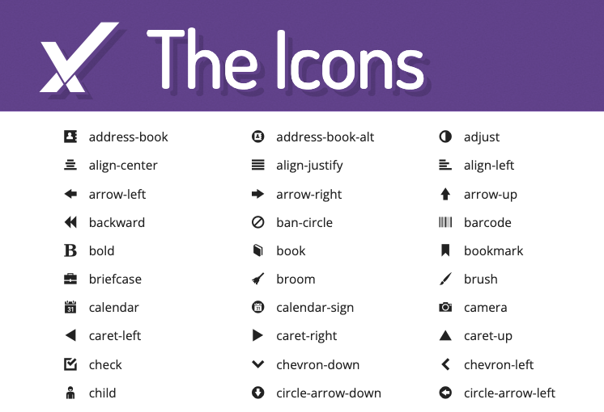
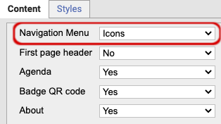
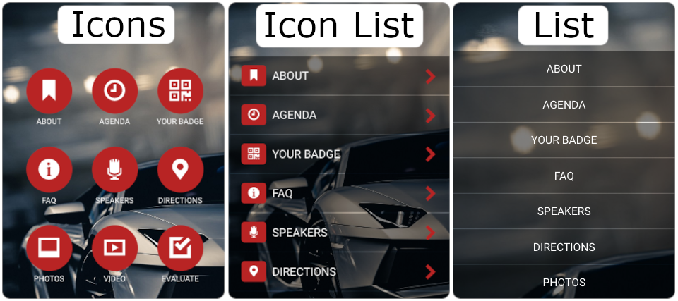
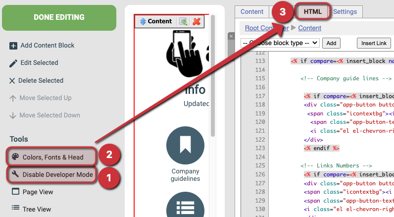

# Changing the mobile app navigation icons (Developer)

This guide explains how to change the icons used in a mobile app component's navigation menu.

The navigation menu uses icons from [Elusive Icons](https://elusiveicons.com/icons/). You can swap them for any of the 300+ available icons by editing the app's HTML. You need Developer permissions on your user account to make these changes.

***

### 1. Choose which icons to use

Browse the icon list at [elusiveicons.com](https://elusiveicons.com/icons/) and pick the icons you want.

[

](https://downloads.intercomcdn.com/i/o/467403408/8cf83dfe3a6ecf908c2b9a64/app-elusiveicons-list.png)

The Elusive Icons list page

### 2. Look up the icon tag

Click the icon you want to use. Look for its el-tag — the icon name starting with "el-". For example, the calendar icon has the tag `el-calendar`. Note the tag — you will paste it into the HTML in a later step.

[

](https://downloads.intercomcdn.com/i/o/467404444/50ba922f497aa71733a15555/app-elusiveicons-iconcode.png)

Elusive Icons page for the calendar icon

### 3. Check which navigation menu style is in use

In eMarketeer, check which navigation menu style your app uses. The setting is called **Navigation Menu** and lives at the top of the Settings tab for the Content block.

Navigation Menu setting location on the Content Settings tab

There are three navigation menu styles: Icons, Icon List, and List. Note which one you use — you only need to change icons for that style.

The three navigation menu style options

### 4. Open the HTML tab

On the mobile app component's editing page, click **Enable Developer Mode** in the left-side Tools menu, open **Colors, Fonts & Head**, and switch to the **HTML** tab in the right-side menu.

If you do not see the Developer Mode link, ask an account administrator to grant Developer permissions to your user account.

[

](https://downloads.intercomcdn.com/i/o/467405809/2a5e2703535471d490640f41/app-html-tab.png)

Navigating to the HTML tab in Developer Mode

### 5. Find the icon in the HTML

The HTML tab has two places where icons are defined. One controls the **Icon List** navigation style, the other controls the **Icons** style.

The top-level part of the HTML labels each section as `iconlist` or `icons`. Each navigation icon has its own sub-section. Inside, look for the el-tag of the icon currently in use, such as `el-time` or `el-bookmark`.

#### Iconlist HTML

[

](https://downloads.intercomcdn.com/i/o/467437532/3f94673815295cdcc491f545/app-iconlist.png)

Location of the iconlist icon code in the HTML (usually close to line 113)

#### Icons HTML

[

](https://downloads.intercomcdn.com/i/o/467437560/786013c0d589590cb65d0126/app-icons.png)

Location of the icons icon code in the HTML (usually close to line 237)

### 6. Replace the icon tag and save

Change the current el-tag to the new one for your chosen icon, then save the HTML. For example, to change "Company News" from a bookmark icon to a calendar icon, replace `el-bookmark` with `el-calendar`. Leave the surrounding tags alone — `el`, `el-inverse`, and `el-fw` are the same for all icons in the app component.
