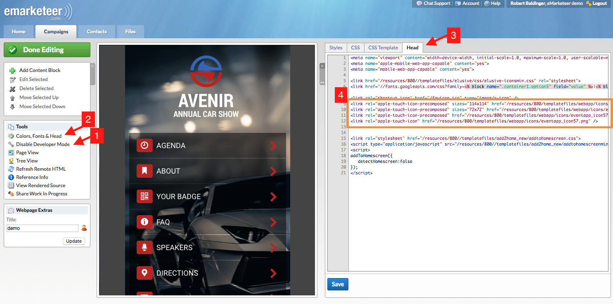

# Change home screen icon in Web App

Replace the default eMarketeer icon with your own when saving a Web App to a mobile home screen.

This article applies to older web app templates only. Updated versions of the app have a built-in image browser for web app icons and favicons in the settings block, as shown below.

Web App icon fields

When you save the Web App to your mobile home screen, the default icon used is the eMarketeer logo shown below.

To use a custom icon, follow the steps below.

## Create a custom icon

Create a square image at least 254 pixels wide and tall, and no more than 1024. Save the image as PNG or JPG.

> TODO: verify — original lists "png, jpg or png format" which is a typo; confirm the supported formats.

## Upload the image to eMarketeer and get the URL

Go to Files in eMarketeer and upload the image to a folder of your choice. Click to preview the image and copy the relative URL (without the domain name), as shown below.

## Paste the new URL into the web app header

Open your Web App in developer mode and change the icon URLs.

1. Enable developer mode. If you don't see this option, ask your admin to grant the privilege.
2. Click Colors, Fonts & Head in the left menu.
3. Click the Head tab.
4. On lines 9-12, paste your new URL on all four rows.
5. Click Save.

Your app now uses the new icon when saved to a home screen.
