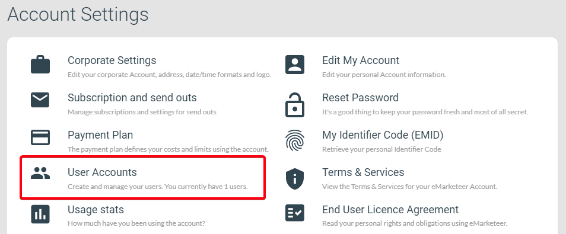
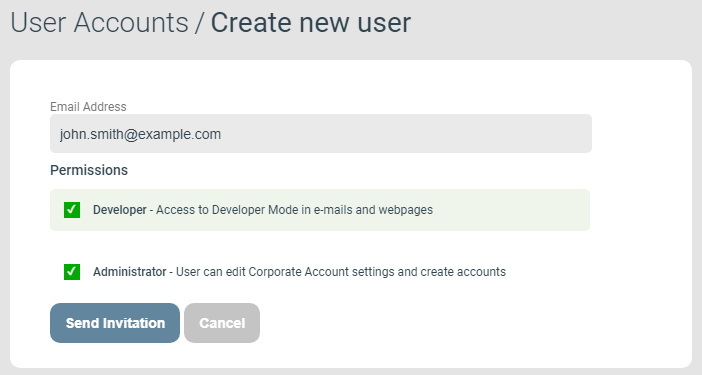

# How to invite users to your account (administrator)

This guide shows administrators how to invite a new user to your eMarketeer account.

If you cannot find the User Accounts settings page, you do not have permission to invite or create users. Contact an administrator on your account or technical support for help.

## Open User Accounts settings

Navigate to the User Accounts settings page via the Company Account Settings.

Account Settings page

## Send the invite

On the User Accounts page, click Invite User to start the invite process.

Invite User button

This opens the Create New User page. Enter the email address of the new user, select their permissions, and send the invitation email.

* Developer: can access Developer Mode in components for advanced customisation.
* Administrator: can access the Corporate Account Settings and invite users to the account.

Create New User page

The invite email contains a link to a page where the user can create their account if they do not already have one. If they already have a user account on another account, they gain access to the new account in addition to their existing ones.
