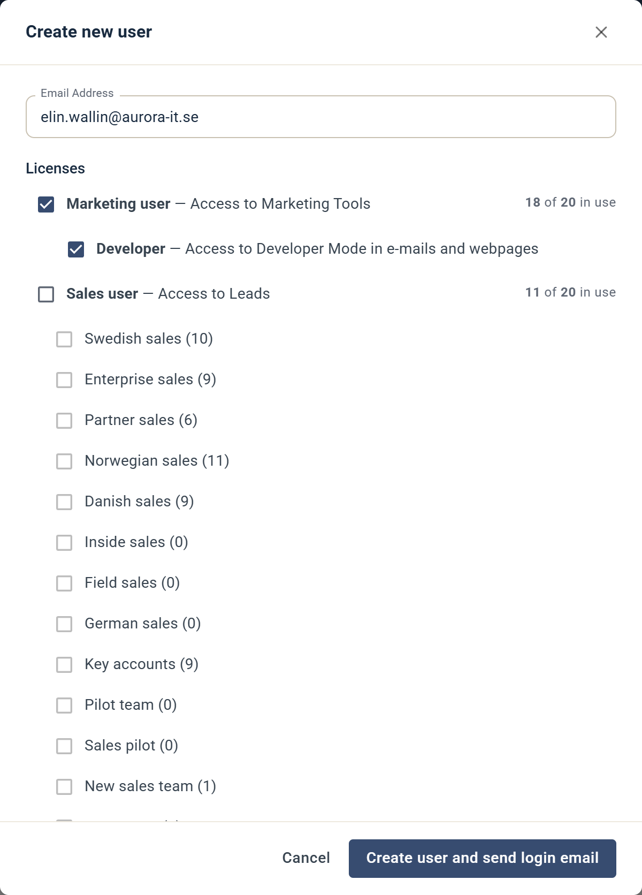

# How to invite users to your account (administrator)

This guide shows administrators how to invite a new user to your eMarketeer account.

If you cannot find Users & Teams in Account Settings, you do not have permission to invite or create users. Contact an administrator on your account or technical support for help.

## Open Users & Teams

Click the gear icon at the top right, choose Account Settings, and open Users & Teams. The User Accounts tab lists your users.

## Send the invite

On the User Accounts tab, click Create User to start the invite process.

This opens the Create new user dialog. Enter the email address of the new user, select their licenses and access, and click Create user and send login email.

* Developer (a license under Marketing user): access to Developer Mode in e-mails and landing pages for advanced customisation.
* Administrator (under Access): can edit the Corporate Account settings and create accounts.

The invite email contains a link to a page where the user can create their account if they do not already have one. If they already have a user account on another account, they gain access to the new account in addition to their existing ones.
