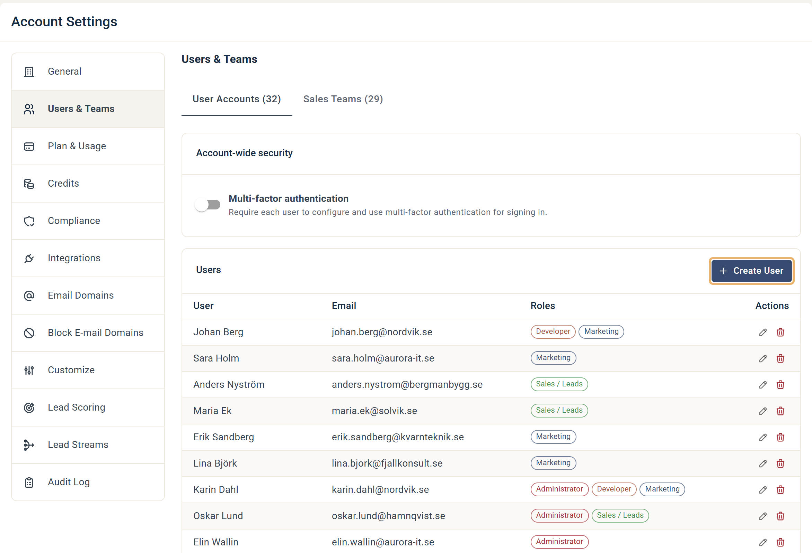

# How to invite users to your account (administrator)

This guide shows administrators how to invite a new user to your eMarketeer account.

If you cannot find Users & Teams in Account Settings, you do not have permission to invite or create users. Contact an administrator on your account or technical support for help.

## Open Users & Teams

Click the gear icon at the top right, choose Account Settings, and open Users & Teams. The User Accounts tab lists your users.

## Send the invite

On the User Accounts tab, click Create User to start the invite process.

This opens the Create new user dialog. Enter the email address of the new user, select their licenses and access, and click Create user and send login email.

### Licenses

* **Marketing user**: access to the marketing tools, such as campaigns and journeys. A marketing user can view the Lead board, but can't be assigned leads or work with them.
  * **Developer**: a role for marketing users, not a separate license. It gives access to Developer Mode in emails and landing pages. Only developers can create and update component templates.
* **Sales user**: access to the Lead board to work with leads. A sales user must be assigned to a sales team. Your sales teams are listed under Sales user in the dialog. Tick the team or teams the user belongs to.

The dialog shows how many licenses of each type are in use. If you need more, click Manage Payplan.

### Access

* **CRM Web Panels**: access to the eMarketeer web panels in your CRM tool, such as Contact Summary and Company Summary. For SuperOffice, see [Web panels](../../documentation/superoffice/integration-features-and-flows.md#web-panels) in the SuperOffice integration features and flows article.
* **Administrator**: can edit the account settings and invite new users.

The invite email contains a link to a page where the user can create their account if they do not already have one. If they already have a user account on another account, they gain access to the new account in addition to their existing ones.
