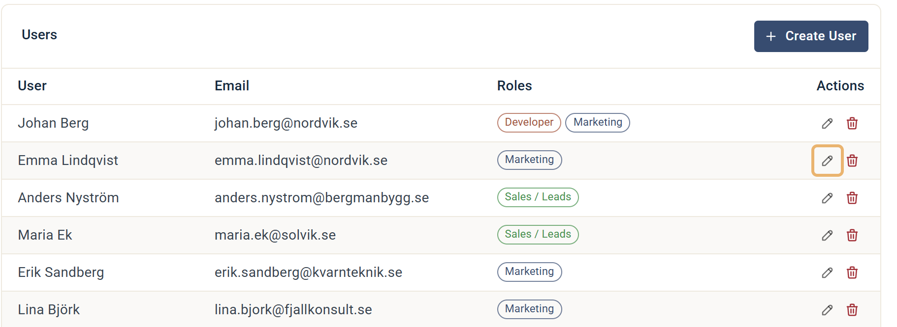
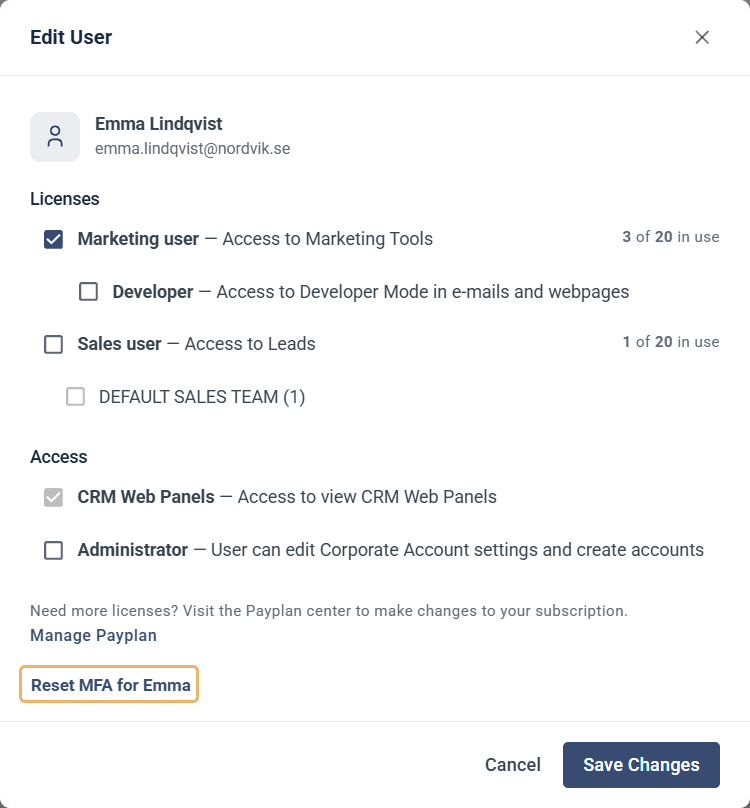

# Reset MFA for a user (administrator)

This guide shows how an administrator resets multi-factor authentication (MFA) for a user on the account.

A reset is needed when a user can't sign in with their authenticator app any more. The most common reason is that they have switched to a new phone. After the reset, the user can set up MFA again on the new phone.

## Reset MFA

1. Click the gear icon at the top right, choose **Account Settings** and open **Users & Teams**.
2. On the **User Accounts** tab, find the user and click the edit icon (pen) on the right of their row.

3. In the **Edit User** dialog, click **Reset MFA for** followed by the user's first name.

The reset happens straight away. A message confirms that the MFA settings have been reset for the user.

## What happens next

The next time the user signs in, they set up MFA again with their authenticator app on the new phone. Send them the steps in [User guide: Enable Multi Factor Login](user-accounts.md).

## If you aren't an administrator

Only an administrator on your account can reset MFA. If you have switched phones or lost access to your authenticator app, ask an administrator on your account to reset your MFA.

If you saved your recovery code when you set up MFA, you can use it to sign in in the meantime. See [Next time you log in](user-accounts.md#next-time-you-log-in).
