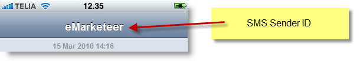

# SMS Sender ID

The Sender ID is the text or number shown to recipients as the source of an SMS.

When you receive an SMS from another mobile phone you see the sender's number. When the SMS comes from a service such as eMarketeer, the sender can be a custom text — typically your company name.

## Create your own Sender ID

To have your company name shown as the sender, contact support and we will set it up for you.

* The Sender ID must be 3–11 characters long, use only A–Z, a–z, or 0–9, and it cannot start with a number or be a phone number.
* Requests are processed manually. During office hours we usually complete them the same day, unless we need more information.
* Send the Sender ID you want and the name of the account where it should be applied to support@emarketeer.com.

## Why do I need to apply for a Sender ID?

The ability to customize a Sender ID can be abused for spamming and spoofing. Spoofing is when someone masquerades as another party by falsifying data and gaining an illegitimate identity.

For example, a Sender ID could be set to another person's number to defraud, harass, or impersonate. To prevent abuse while still offering the feature, each customized Sender ID must be registered and authenticated before use.

## Limitations

Most Belgian, US, and Mexican mobile operators do not support alphanumeric sender information. If you send an SMS to a recipient on one of these operators, the Sender ID is replaced with a random-looking number. The same applies to some other features such as multi-part SMS and Unicode. See the [Whitelist of countries supporting SMS Sender ID](https://support.emarketeer.com/documentation/sender-id/whitelist-of-countries-supporting-sms-sender-id/) for the full list.

Our SMS service provider (46elks) cannot always guarantee that the Sender ID will be displayed.

46elks disables the feature on certain routes, and so does their upstream supplier. Mobile operators often filter text messages, which can result in non-delivery — and the top priority is message delivery, not features. Many operators do not allow SMS aggregators to use the Sender ID feature.

If recipients must know who the message is from, include your company, product, or system name in the first line of the message. Most handsets show the first characters of an SMS in the notification before it is opened.
