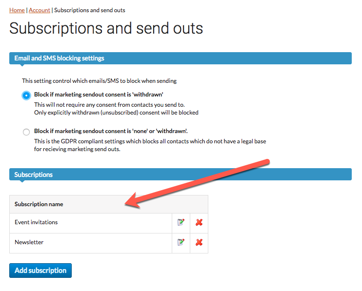
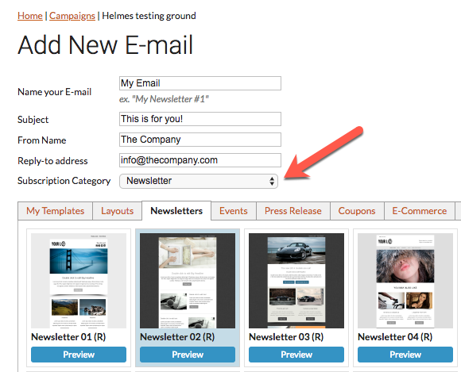
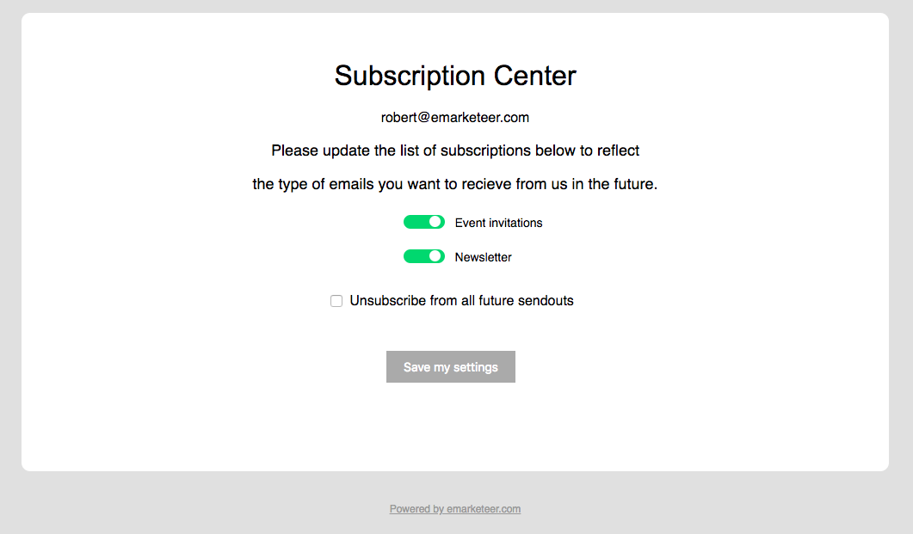

# Subscriptions

Subscriptions give contacts control over which types of emails they receive, so they can opt out of specific categories rather than unsubscribing entirely. This typically reduces full opt-outs.

You organise your emails into categories — for example, Newsletters, Event invitations, or Special offers. When you send, eMarketeer automatically excludes contacts who have unsubscribed from that category. An email with no category assigned is only filtered for contacts who have fully withdrawn their marketing consent.

## Set up subscription categories

You need administrator access to create and manage subscription categories.

1. In the top navigation, click **Account**.
2.  Click **Subscription and send outs**.

    

3.  Create your categories. Keep names short and clear — contacts see them in the subscription center. Focus on broad communication types rather than very specific ones.

    

## Your contacts

All contacts — new and existing — start with every subscription category turned on. To change subscription settings for a group of contacts at once, use the bulk update action on a contact list.

## Create an email

When you create a new email, a subscription category dropdown appears in the email settings. Select the category that best matches the email's content.

If the email does not belong to any category — for example, a one-time notification — set it to **None**. Emails set to None are only filtered for contacts who have fully unsubscribed.

## Subscription center

The subscription center is a public page where contacts manage their email preferences. It lists all active categories, each with a toggle. Contacts can also check a box to fully opt out and withdraw all marketing consent.

The standard unsubscribe link in email footers automatically links to the subscription center.

## Automations

You can change a contact's subscription status automatically using Journey automations. Add a step that triggers when a contact interacts with a component — for example, to remove them from a category after they click a specific link.

***

**Related:**

* [Exclude inactive recipients](../../documentation/email-sms/exclude-inactive-recipients.md)
* [Transactional sendouts](../../documentation/email-sms/transactional-sendouts.md)
* [Whitelisting email servers](../../documentation/email-sms/whitelisting-email-servers.md)
* [Automatic send pause](../../documentation/email-sms/automatic-send-pause.md)
