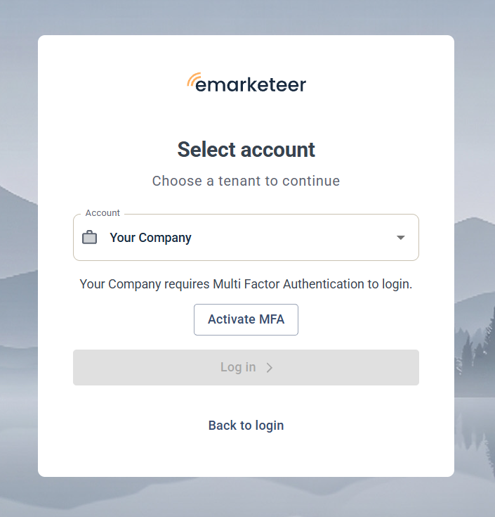
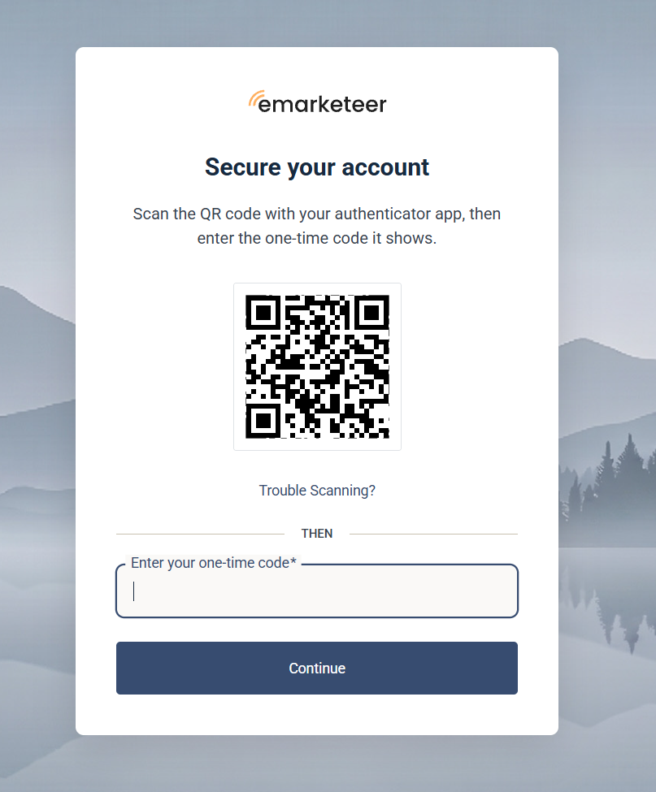
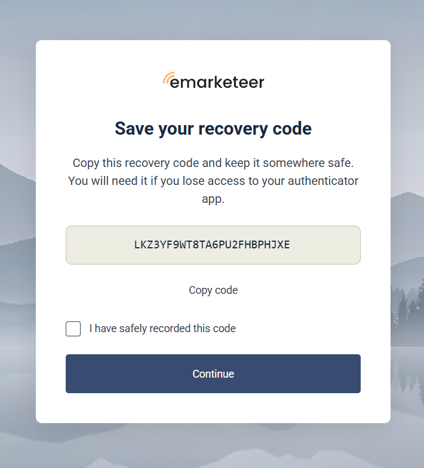
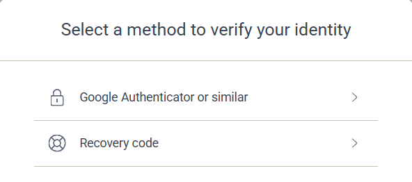

# User guide: Enable Multi Factor Login

Set up Multi-Factor Authentication (MFA) for your eMarketeer login in three steps using an authenticator app. For background on MFA, see [this article](../../documentation/accounts-auth/multi-factor-authentication.md).

### Download an authenticator app

Before you start, install an authenticator app on your mobile device if you don't have one. We recommend Google Authenticator or Twilio Authy. Use the links below or search your app store.



#### Google Authenticator




#### Twilio Authy 2-Factor Authentication




## Set up MFA

Follow these steps after you or your admin has enabled MFA on your account. You can also enable it yourself in eMarketeer: click your avatar at the top right, choose **My Profile**, open the **Security** tab and switch on **Multi-factor authentication**.



### Go to the eMarketeer login page

Enter your username and password. If your account requires MFA, the **Select account** screen shows an **Activate MFA** button. Click it.




### Set up the app

A QR code appears. Open your authenticator app on your phone and tap "Scan QR code". Scan the QR code on your computer screen. The app shows a six-digit code — enter it on the computer screen and click "Continue".




### Save the recovery code

You're now authenticated, but before you continue you're shown a recovery code. Use this code to sign in if you don't have your phone with the authenticator app. Save it somewhere secure. Tick the checkbox to confirm you've saved it, then click "Continue".




## Next time you log in

The first time you sign in after setting up MFA, you're asked to select a method to verify your identity. Choose **Google Authenticator or similar**. You only make this choice once. After that, eMarketeer goes straight to the code prompt.

You then see a "Verify your identity" prompt. Open your authenticator app, read the six-digit code, and enter it in the **Enter your one-time code** field. Tick **Remember this device for 30 days** if you don't want to use the app on every sign-in, then click **Continue**.

If you don't have your phone with you, click **Try another method** and sign in with your recovery code.

If you have any trouble signing in, contact support through the chat box on the login page.
