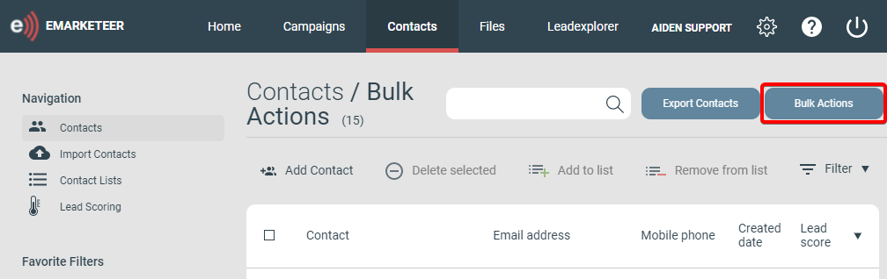

# Bulk Actions: A Tool for Managing Lists of Contacts

If you need to manage or update lists of contacts then Bulk Actions can be a useful tool to you. A button to open the Bulk Actions tool is available in conjunction with Selections, Lists and Contact Pages and can usually be found right next to the Export button.

Image showing the location of the Bulk Actions button on the Contacts Page of a Contact List

## Bulk Action Options

### These are 9 main functions of the Bulk Actions tool

1.  **Permanently Delete Contacts**
    -   Permanently Deletes the Contacts from your eMarketeer Account along with any interactions that they have been part of.
    -   Deleted contacts cannot be restored and this includes any interactions, activity, and engagement history.
2.  **Add to Contact List**
    -   Adds the Contacts to a Contact List specified in the next step.
    -   A new Contact List can be created if a list for the purpose does not exist.
3.  **Remove from Contact List**
    -   Removes the Contacts from a Contact List specified in the next step.
4.  **Unsubscribe**
    -   Unsubscribes the Contacts from ALL future email and SMS sendouts by changing the Legal Basis setting for Marketing Sendouts to “Withdrawn”.
5.  **Update Legal Basis**
    -   Update the Legal Basis of all of the contacts.
    -   Can update the settings for both “Store and Process” and “Marketing Sendouts” at the same time, and to different options if required.
6.  **Update Category**
    -   Updates the Contact Category of all of the contacts.
7.  **Add Tags**
    -   Adds the selected Tag(s) to of all of the contacts.
8.  **Remove Tags**
    -   Removes the selected Tag(s) to of all of the contacts.
9.  **Update Subscriptions**
    -   Change the Opt-in/Opt-out status of Subscription Lists for the contacts.
    -   Can update the settings for any or all Subscription Lists in one go.
